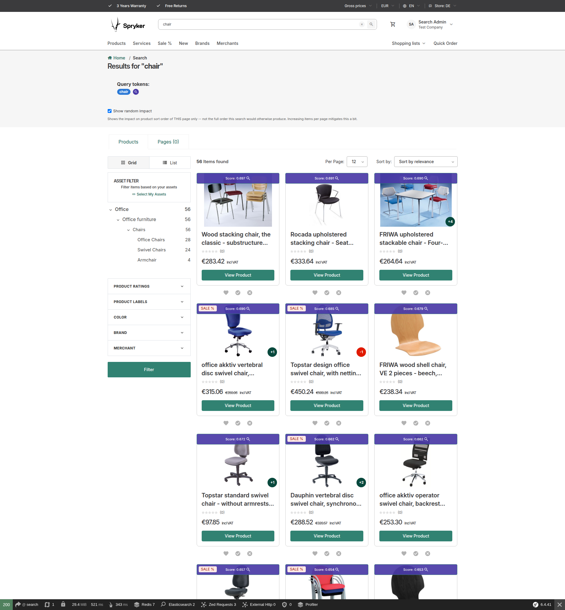

# Spryker Search Ranking

[](https://github.com/andrebarthelmeshellmuth/spryker-search-ranking/actions/workflows/ci.yml)
[](composer.json)
[](phpstan.neon)
[](LICENSE)

Data-driven search ranking for Spryker Commerce OS: rank search results by **business signals**
(PDP impressions, sales, or anything else you can measure) instead of relying on string matching
alone. Based on Spryker's
[data-driven ranking best practice](https://docs.spryker.com/docs/pbc/all/search/latest/base-shop/best-practices/data-driven-ranking).

Designed as the companion package to
[spryker-community/search-debug](https://github.com/andrebarthelmeshellmuth/spryker-search-debug) —
the eventual `function_score` ranking is meant to stay fully inspectable in the search-debug overlay.

The standout piece: a data-driven normalization-authoring GUI. As you type a formula, the server
evaluates it against the metric's own real distribution and draws the curve live, alongside ranked
closed-form curve-fit suggestions — no guessing what shape a business signal should take:


*Part of the [Search Relevance](https://search-relevance.dev/) project — explore the interactive ranking-formula walkthrough there.*

> **Not an official Spryker project.** `spryker-community/*` is an independent, community-built
> package namespace with no affiliation to, sponsorship by, or endorsement from Spryker Systems GmbH.
> The name describes what these packages are (community contributions for Spryker Commerce OS), not who
> maintains them. The matching Packagist namespace is held by an unrelated GitHub organization, which is
> why installation goes through a VCS repository entry rather than a plain `composer require` — see
> [Installation](#installation).

## Contents

- [Status](#status)
- [Before you start: this needs real business-signal data](#before-you-start-this-needs-real-business-signal-data)
- [What it does](#what-it-does)
- [Modules](#modules)
- [Requirements](#requirements)
- [Installation](#installation)
- [Limitations](#limitations)
- [License](#license)
- [Acknowledgements](#acknowledgements)
- [Documentation](#documentation)

## Status

Feature-complete: business-signal search ranking, including the normalization-authoring GUI's
data-driven curve-fitting workflow.

Verified: dependency floors resolved and checked at their oldest allowed versions (`composer
check-floors`), the ranking formula's `function_score`/`script_score` cross-validated across three
engines and two Lucene generations (see [Search engine compatibility](#search-engine-compatibility)), 238
tests, phpcs and phpstan level 8 clean.

This package's own mechanism is complete: the metric/value data model, the Zed management UI, CSV data
import, the normalization cron, the export of normalized signals into the Elasticsearch page documents
(`scores` field), the **`function_score` ranking itself**: catalog searches are re-scored by
`relevanceWeight × normalizedRelevance + (1 - relevanceWeight) × Σ weightᵢ × signalᵢ`, with the metric
weights and the two blend constants editable in Zed and synchronized to key-value storage — see
[Ranking formula](docs/ranking-formula.md) for the full rationale — and a **data-driven normalization-authoring
GUI**: a live preview of the typed formula against the metric's own real distribution, plotted alongside
the theoretical max-discrimination reference curve, with ranked closed-form curve-fit suggestions.

This package deliberately scopes itself to *using* business signals to rank — deciding what the weights
*should* be (tuning, evaluation, calibration) is a different concern. Nothing here depends on that
decision being automated; a separate layer could reasonably be built on top of this one later without
requiring any change here.

## Before you start: this needs real business-signal data

Installing and wiring this package is not, by itself, enough to change a single search result's rank. It
is a mechanism that blends **normalized business-signal values** into the query score — with no imported
values for a metric, that metric has nothing to contribute, and the blend degrades quietly, not loudly:

- **A metric with a non-zero configured weight but zero imported raw values** (nobody has ever run
  `search-ranking:import` or the metric's data-import CSV for it) never gets normalized —
  `ProductMetricNormalizer::normalizeMetric()` checks `getMetricStatistics()`'s row count first and
  returns immediately when it's zero, so the metric's `scores.<name>` field is simply never populated in
  the product documents. At query time, `FunctionScoreBuilder`'s painless script guards every signal read
  with `doc.containsKey(...) && doc[...].size() > 0 ? value : 0` — a missing field contributes exactly
  `0`. Because that `0` is uniform across every product, it doesn't change relative order at all: the
  blended score reduces to `relevanceWeight × normalizedRelevance` for every hit alike, which — since the
  saturating curve is monotonic in `_score` — sorts identically to plain text relevance. **The formula
  runs, the weight is configured, nothing errors, and the ranking looks exactly like this package was
  never installed.** There is no warning anywhere in the Zed GUI today that a configured metric has zero
  underlying data.
- **When *no* active metric has a non-zero weight at all**, `FunctionScoreBuilder::build()` returns `null`
  and `SearchRankingFunctionScoreQueryExpanderPlugin` leaves the query untouched — the plain, unwrapped
  text-relevance query runs instead. This case at least is documented (see the plugin's own docblock) and
  costs nothing extra at query time, unlike the previous case.

**In short:** import real per-product values — via the data-import CSVs above, or your own project-level
`DataImportPlugin` pulling from wherever your business signals actually live (a BI export, an analytics
warehouse, an events pipeline) — for every metric you give a non-zero weight, and run the normalization
cron, *before* judging whether the ranking formula is doing anything. A fresh install with default demo
weights and no imported data will rank exactly like stock Spryker search — indistinguishably so, with no
error to tell you why.

This package itself never computes or writes a raw value on its own; it only reads whatever was imported.
Don't confuse this with `spryker-community/search-ranking-optimizer`'s relevance-judgment widget (the
heart/checkmark/✕ buttons an admin user submits per search result) — that writes to a completely separate
table used to score the *optimizer's* own rank-eval tuning runs, and never touches
`spy_search_ranking_product_metric`. It has no bearing on whether this package's metrics have data.

> **This repo's own demo data is fixtures, not a model to imitate.** The
> `data/import/common/common/search_ranking_metric.csv` / `search_ranking_product_metric.csv` files
> shipped in this project's demo shop contain made-up numbers for a handful of SKUs, purely so a fresh
> install has *something* to render in the Zed GUI and to blend into search results. A real shop's
> `pdp_impressions`, `top_seller`, etc. need to come from that shop's actual analytics — copying the demo
> CSVs' shape is fine, copying their *values* is not.

## What it does

- **Ranking metrics** (`spy_search_ranking_metric`): named business signals (e.g. `pdp_impressions`,
  `top_seller`, `random`) with a **weight** for their contribution to the combined score, an
  **active** flag, a **normalization formula** stored as an expression string, and a **direction** flag
  (`isHigherBetter`) — whether a higher raw value is the better outcome (sales, impressions) or a lower
  one (days-since-restock, return rate). Direction is business knowledge that cannot be inferred from the
  data; it only steers which curve-fit suggestions the normalization GUI offers below, never the formula
  itself. A fourth global flag, **`isLocaleScoped`** (default `false`), decides whether formula/active/
  weight together need genuine per-locale granularity for this metric, or stay fanned out identically
  across a store's locales — see [Terminology](docs/terminology.md) for the full scope breakdown and what
  turning it on does.
- **Product values** (`spy_search_ranking_product_metric`): one row per (metric, abstract product)
  pair holding the **raw real-world value** (e.g. "8,250 impressions") and the **normalized value
  in ]0;1]** derived from it. Unique per pair, removed by cascade with either parent.
- **Metric history** (`spy_search_ranking_metric_history`): every time a metric's formula, weight,
  active flag or direction actually changes — via the Zed edit form, or any other process that saves
  through the facade — a snapshot is appended: the new config, the metric's [digest](docs/terminology.md#digest) at that moment
  (min/max/mean/median/percentiles, null if none existed yet), and the new formula's R² against that
  digest. Append-only, never updated; deliberately **not** a hard foreign key to the live metric row, so
  history outlives a later rename or deletion. A save that changes nothing (a re-submitted, unmodified
  form) writes no row — this is a change log, not an access log. `metricName` is denormalized for the
  same outlive-the-live-row reason.

  The `isChange` flag on every row (always `true` for the writer that populates it) exists for a
  specific reason: a periodic drift-detection job should compare a metric's CURRENT digest against the
  digest **as of its last real change**, not merely against last month's snapshot — otherwise the
  comparison window silently resets every period regardless of whether anything happened, and gradual
  multi-month drift can stay invisible because each individual month-over-month delta looks small.
  Concretely: if a monthly check finds the fit still adequate at 30 days and changes nothing, the *next*
  check should compare against the 30-day-old baseline grown to 60 days, not reset to "vs. 30 days ago"
  again — `isChange` is what lets that job find the right anchor point (the newest row where `isChange =
  true`) instead of just the newest row. A check-only run (fit still fine, nothing changed) would append
  its own row with `isChange = false`, extending the timeline without moving the anchor.

  Four read-only primitives on `SearchRankingFacade` exist specifically for a drift-detection job like
  that to build on, without it needing any direct database access of its own: `findLastMetricChangeHistoryEntry()`
  (the anchor row above), `evaluateCurrentMetricFit()` (a fresh, side-effect-free "how well does this
  metric's CURRENT formula fit its CURRENT digest right now" read for one given locale — never writes a
  history row, safe to call as often as needed), `evaluateCurrentMetricFitAcrossLocales()` (the same
  check, once per real locale of a store, keyed by locale name — the evidence for whether a metric should
  be flagged `isLocaleScoped=true` in the first place, see [Terminology](docs/terminology.md)'s `metric` entry,
  as well as the ongoing diagnostic for whether a store-wide formula still fits every locale's own real
  data comparably well once it's set), and `recordCheckOnly()`
  (appends the `isChange = false` row itself once a check has run). This package makes no decision about
  thresholds, schedules, or notifications with them — that policy is deliberately somebody else's job to
  build on top. `spryker-community/search-ranking-optimizer`'s own monthly auto-tune job is exactly that:
  its console report flags a metric whose per-locale fit spreads by more than a configurable threshold,
  purely informational today (nothing acts on it differently per locale yet).
- **Zed UI**:

  

  Every scoped page below (Metrics, Product Values, Product Value Gaps, Settings) has an explicit
  **Store + Locale selector** at the top — a plain GET dropdown pair, not a Symfony form, since it's a
  view filter rather than a mutating action. Whichever scope is selected carries through create/edit/
  delete links and save actions on that page, so an admin explicitly picks which store's config they're
  looking at rather than it being implicit from a session-level "current store."

  - `/search-ranking-gui` — metric list with create/edit/delete. Formulas are validated on save by
    trial evaluation; the exact parser error is shown on the form. Metric names are checked for
    uniqueness. Deletion is a CSRF-protected POST.
  - `/search-ranking-gui/product-metric` — read-only, searchable table of all product values
    (abstract SKU, metric, raw value, normalized value, last update).

    
  - `/search-ranking-gui/product-metric-gap` (linked from the Product Values page's "View Gaps" button)
    — a read-only, searchable table of every (product abstract, active metric) pair with **no
    `spy_search_ranking_product_metric` row at all** — never imported, or imported then deleted. With
    *N* products and *M* active metrics, `N × M` rows is the fully-covered baseline; this page is where
    that gap actually becomes visible, instead of being invisible inside a
    `spy_search_ranking_product_metric` table that simply has fewer rows than expected. Defaults to
    gaps across **every** active metric (SKU + which business score is missing); the dropdown narrows
    to one metric at a time.

    **Raw SQL, deliberately** — the one query in this whole package that isn't built through Propel's
    ActiveQuery. This needs either a `UNION` of one query per active metric, or a genuine `CROSS JOIN`
    between `spy_search_ranking_metric` and `spy_product_abstract` — two tables with no direct relation
    between them; every real relation here runs through `spy_search_ranking_product_metric`'s own two
    foreign keys, which is exactly right (a metric applies to many products, a product has many
    metrics — that association, and the value it carries, belongs entirely to the junction table, not
    to either side directly). Propel 2.0 (what this project runs) has no `UNION` support at all in its
    query builder, and a `CROSS JOIN` has no declared relation for Propel's generated `joinX()` methods
    to hang off. Given the real scale here (a shop with thousands of products and a handful of metrics —
    tens of thousands of combinations, not millions), a hand-rolled `CROSS JOIN` in raw SQL was the
    simpler and more honest choice over reusing the single-metric `LEFT JOIN` once per active metric and
    merging the results in PHP (which would have stayed inside Propel, at the cost of losing real
    database-level pagination and sorting across the merged set). Every value that varies per call is
    bound as a parameter; `$sortColumn`/`$sortDirection` are resolved through a fixed whitelist, never
    interpolated from caller input directly — see `ProductMetricGapFinder`'s own docblock.
  - `/search-ranking-gui/metric-history` — read-only, searchable, newest-first table of every row in
    `spy_search_ranking_metric_history`: the metric name and formula at that point in time, weight,
    active flag, direction, the formula's R² fit against the digest at that moment (a dash when no
    digest existed yet), and whether the row is a real change or a check-only snapshot (see `isChange`
    above). Each row links back to the live metric's edit page via its `fkSearchRankingMetric` (the
    metric itself may since have been renamed or deleted — the link simply 404s in that case, since the
    history row intentionally keeps no hard foreign key). No filtering by metric or date range yet; add
    a `?id-search-ranking-metric=` query-string constraint here if that becomes necessary once the table
    grows.

    
  - **Normalization-authoring preview** (on the metric edit page): as you type a formula, a debounced
    request asks the server to evaluate it at ~100 sample points spanning the metric's own real
    distribution (never a JS reimplementation of the expression-language math) and draws the resulting
    curve as an inline SVG, alongside the **empirical CDF** — the theoretical max-discrimination
    normalizer (map each raw value to the fraction of products below it) — as a reference line. Below the
    plot, ranked **curve-fit suggestions** (`atan(x/k)`, `x/(x+k)`, `log(1+x/k)/log(1+max/k)`, `pow(x/max,
    p)`, a sigmoid, linear, and — for `isHigherBetter=false` metrics — an `exp(-x/tau)` decay) show how
    closely each closed-form shape tracks that empirical CDF (R²), with a one-click "use this formula"
    action. The best fit is a data-driven *default*, never imposed — a metric can have a legitimate
    business reason (e.g. a rating signal where only 4.5★+ should approach 1) to deviate from the
    statistically "ideal" spread. Whichever candidate's formula the saved one byte-for-byte matches (both
    are deterministic functions of the same digest, so a genuine match reproduces exactly) has its stable
    family slug (`atan`, `sigmoid`, `hyperbolic`, ...) persisted onto the metric's own `shape` — silently
    `null` for a freeform/custom formula that matches no offered candidate. This is derived bookkeeping,
    not something to set directly: it exists so on-top tooling can tell "still the same curve family,
    just re-fitted" apart from "a materially different shape was chosen" without re-parsing formula
    strings.
- **Data import**: importer types `search-ranking-metric` (upsert by name) and
  `search-ranking-product-metric` (resolves metric name + abstract SKU to foreign keys, writes raw
  values only — normalized values are never imported). Both writer steps go straight to Propel rather
  than through `SearchRankingFacade` — the standard Spryker DataImport convention, needed since a
  per-row facade call would add mapping/validation/transaction overhead on top of what the
  batch/transaction machinery around each step already does. The one real consequence: importing a
  metric this way skips the formula validation and history recording `saveMetric()` normally does, so a
  malformed formula in a CSV row surfaces later — as a per-metric skip reported by the next
  `search-ranking:normalize` run — rather than failing the import immediately. The metric NAME is the one
  exception: it's validated immediately and fails the import row (not deferred like the formula), since a
  name `FunctionScoreBuilder` doesn't recognize as a safe painless-script identifier would otherwise
  silently never contribute to live ranking while still consuming weight-normalization budget and still
  rendering as a live contribution in the search-debug overlay. The product-metric
  importer has no such gap: there's no facade-level "save one product metric" method it bypasses, this
  direct upsert is the only path that data ever takes.
- **Normalization cron**: `vendor/bin/console search-ranking:normalize` recalculates every
  normalized value of every active metric **except the random tie-breaker metric** (see below), for
  **every store×locale**, in batches. A metric whose formula fails to evaluate is skipped and reported
  (non-zero exit code) without aborting the run for the other metrics. As a byproduct, it also rebuilds
  each active metric's **distribution digest** (`spy_search_ranking_metric_digest`) per scope:
  min/max/mean/median plus a 101-point empirical-CDF backbone (percentiles 0, 1, 2, ..., 100), computed by
  sorting that metric's raw values once — this is the data the normalization-authoring preview above
  reads, so it never has to touch the raw per-product rows directly, however many there are. Optional
  `--store=X`/`--locale=Y` restrict a run to one scope; omitting either processes every store, or every
  locale available for the selected store(s) — the default, unfiltered behavior is unchanged from before
  this package was store/locale-scoped at all.
- **Random tie-breaker cron**: `vendor/bin/console search-ranking:randomize` is a separate, nightly
  command that reshuffles ONE metric — the one configured as the random tie-breaker
  (`SearchRankingConfig::getRandomMetricName()`, `random` by default) — for every store×locale where it
  exists and is active, and republishes affected products once at the end, on its own cadence, independent
  of the hourly normalize run above. It is a deliberate no-op (exit 0, no work done) for a scope where that
  metric does not exist or is not active, so it is always safe to keep scheduled regardless of whether the
  metric happens to be turned on everywhere. Kept separate from the hourly cron because reshuffling a
  tie-breaker every hour would make search result order visibly churn for a shopper who searches again
  shortly after — nightly is frequent enough to keep ties from calcifying into a permanent order without
  looking unstable. Also accepts `--store`/`--locale`, same semantics as `:normalize` above. Reuses the
  same full-republish path as every other score update; see
  [Why full republish, not a partial score-only ES update](docs/design-decisions.md).
- **`search-ranking:check-compatibility`**: probes the live search engine's ACTUAL capabilities —
  never a version-string comparison, since OpenSearch and Elasticsearch report incompatible version
  identifiers under the same API surface (this stack self-reports `distribution: opensearch, 1.3.4`; a
  bare Elasticsearch cluster reports a version number with no `distribution` field at all). Fires
  `_validate/query` cluster-wide for each construct this package uses, or could plausibly use later
  (`function_score` + `script_score`, `rank_feature`, `distance_feature`, `pinned`) and a
  deliberately incomplete `_rank_eval` request to check whether that endpoint is recognized at all,
  reading back the engine's own parser response either way rather than trusting a claimed version.
  Read-only — every probe only asks "would the engine accept this?", it never touches real documents or
  indices. Exits non-zero only if `function_score` + `script_score` is unsupported (the one construct the
  ranking itself actually depends on); every other probed capability is purely forward-looking and never
  affects the exit code, only the printed report.
- **Elasticsearch export**: the package ships a `page.json` fragment defining a dynamic `scores`
  object field (per Spryker's data-driven-ranking best practice) and a ProductPageSearch plugin trio
  — bulk data loader, data expander, map expander — that writes each product's normalized values
  into its page document as `scores: {metricName: value}`. Products without values get no `scores`
  field. After normalizing, the cron triggers `Product.product_abstract.publish` events (chunked)
  for all scored products so the documents refresh; `--skip-publish` suppresses that — a full
  product-page republish rather than a partial score-only write, deliberately; see
  [Why full republish, not a partial score-only ES update](docs/design-decisions.md).
- **function_score ranking**: a `QueryExpanderPlugin` wraps the catalog search query in a
  `function_score` with the painless script
  `params.relevanceWeight * (_score / (_score + params.relevanceSaturationPoint)) + (1 - params.relevanceWeight) * (params.w0 * doc['scores.metric'] + …)` —
  `boost_mode: replace`, weights and both blend constants as script params, every doc-value access
  guarded against missing fields, and metric names validated against a strict pattern before being
  embedded (import data cannot inject script code). See [Ranking formula](docs/ranking-formula.md) for why
  it's shaped this way. It only acts on queries **with a search string** (category/browse pages keep
  their ordering) and silently steps aside when no configuration is synchronized or no active metric
  has a non-zero weight.
- **Ranking configuration in key-value storage**: active metric weights + the two blend constants
  ([`relevanceWeight`](docs/terminology.md#relevanceweight), [`relevanceSaturationPoint`](docs/terminology.md#relevancesaturationpoint)) live
  in **one dictionary document per (store, locale)** (`kv:search_ranking_configuration:{store}:{locale}`,
  lowercased), published from Zed through a storage table with the `synchronization` Propel behavior's own
  `store`/`locale` parameters. Metric CRUD, the settings form, and the cron all republish **every**
  store×locale document in one pass (mirroring the same store-outer/locale-inner fan-out
  `ProductMetricNormalizer` already uses) — there is no way to publish just one scope's document from the
  Zed side, since a save on any one scope's config doesn't imply the others are stale, but republishing
  everything is cheap enough not to bother optimizing. Both blend constants are Zed-editable at
  `/search-ranking-gui/settings`, scoped per (store, locale) via that page's own Store+Locale selector.

  

  Metric weights are **normalized to sum to 1 at publish time, independently per scope**
  (`RankingConfigurationStorageWriter`) — see [Ranking formula](docs/ranking-formula.md) for why. The raw values
  in `spy_search_ranking_metric_weight` are untouched; only each scope's published copy is normalized.
- **search-debug overlay integration** (optional, needs
  [spryker-community/search-debug](https://github.com/andrebarthelmeshellmuth/spryker-search-debug)):
  `SearchRankingProductDebugDataExpanderPlugin` adds a "Business signals" section to the per-product SRP
  overlay — one `signal × weight = contribution` line per metric and their total — plus, distributed
  across a few other dedicated spots in the same overlay (not all bundled into that one section): the
  saturation point (`k`), grouped under "Text signals" with the raw text-match score it normalizes; the
  normalized relevance it produces (`score/(score+k)`), labeled "Text Signal total"; the relevance weight
  (`α`); and the full blend formula, e.g. `0.60 × 0.37 + (1 - 0.60) × 0.53 =`, reconciling exactly with
  the final score shown directly below it. The formula plugs in the already-shown "Text Signal total"
  value directly rather than repeating `score / (score + k)` inline, and spells out `(1 - α)` literally
  instead of pre-subtracting it into a single number, so it stays visibly tied to the `α` line just
  above it. Every number here is rounded to
  `SprykerCommunity\Shared\SearchDebug\SearchDebugConfig::SCORE_DECIMAL_PLACES` (default **3**) — the
  same constant search-debug's own overlay numbers use, so the whole page shows one consistent
  precision; see that package's README for details. Rounding happens only at this display step — the
  underlying floats used for the actual ranking calculation stay full-precision throughout.
- **search-feedback frozen-replay integration** (optional, needs
  [spryker-community/search-feedback](https://github.com/andrebarthelmeshellmuth/spryker-search-feedback)):
  `SearchFeedbackTermVectorSnapshotProviderPlugin` implements that package's
  `TermVectorSnapshotProviderPluginInterface`, exposing the specificity-weighting result this package
  already computed for the current request (via `getLastSpecificityWeightingResult()`) so a filed ticket's
  frozen SRP snapshot can carry it too — zero extra work, no new Elasticsearch call, just reading data this
  package produces anyway. Same soft-`suggest`-only coupling direction as the search-debug integration
  above; neither package requires the other.
- **Scope Copy** (`/search-ranking-gui/scope-copy`) — bootstraps a newly expanded market from an
  established one. One shared source/target Store+Locale picker drives a single combined action that
  copies every metric weight, setting, and `formula`/`isActive`/curve `shape` **explicitly saved** for the
  source scope onto the target scope; a field never touched in the source stays untouched in the target
  too, rather than writing an explicit copy of its code-level default.
  `spy_search_ranking_product_metric`/`_metric_digest` — real, scope-local behavioral data — are never
  copied, so a freshly bootstrapped market still shows its own honest gaps on the Product Value Gaps page.
  For an `isLocaleScoped=false` metric (most metrics — see [Terminology](docs/terminology.md)'s own `metric`
  entry), weight/formula/isActive/shape all fan out to every real locale of the target store regardless of
  which one target locale was picked; only for an `isLocaleScoped=true` metric does the write stay scoped
  to just the one (target store, target locale) pair picked here. Copying between two locales of the
  **same** store therefore only touches anything for `isLocaleScoped=true` metrics — everything else is
  already identical across that store's own locales. (`shape` is always re-detected against the digest of
  whichever locale the write actually lands on, never carried over verbatim — a target with no digest yet
  correctly ends up with `shape=null` even though its `formula` was copied.)

  Blocked by default when the target scope already has any saved configuration; an "Overwrite existing
  target configuration" checkbox is required to proceed. Every copied field is recorded on
  [Metric History](#what-it-does) tagged `scope_copy`, alongside the existing `manual`/`auto_tune`/
  `optimizer_apply`/`checkpoint_restore` sources — one row per locale the write actually touched, same
  fan-out rule as above. A live "This will copy:" preview — every weight/setting/formula/active field the
  source scope currently has explicitly saved, with its real value, plus a "Kept in sync by Lock?" column
  (see below) — re-queries and re-renders on every picker change, so an admin sees exactly what a click on
  Copy now/Lock is about to do before committing to it. Two modes:
  - **Mirror** (default) — copies everything the source has explicitly configured, creating a row for
    anything the target has never configured at all.
  - **Copy only what the target already has** — conservative, opt-in: a weight/setting/metric the target
    has never independently configured is left alone rather than created. The resulting overlap can end up
    smaller than the source's own configuration — the page reports how many items were skipped.

  Two actions:
  - **Copy now** — a one-off combined copy (weight/setting/formula/isActive/shape together, either mode),
    no lasting relationship.
  - **Lock** — runs that same combined copy once, always in Mirror mode, then persists the pairing so the
    daily `search-ranking:scope-copy-sync` cron keeps re-copying **weight/setting only** every day, until
    unlocked. Formula/isActive/shape is bootstrapped by the lock's initial copy but never touched again by
    the daily cron — tuning it changes far less often than weight in practice, so a recurring resync would
    mostly re-copy an unchanged value; re-run **Copy now** whenever it genuinely needs refreshing. Enforced
    at creation time so the database can never hold an invalid pairing: a scope may be the **target of at
    most one active lock** (unambiguous which source feeds it), the **source of many active locks** (one
    mature market can seed several new ones), and never simultaneously a source and a target. This is a
    point-in-time check against **active** locks only, not a lifetime tag — a scope freed by unlocking is
    eligible for either role again in a future lock. Unlocking soft-deletes the row (never hard-deleted) so
    the Active Locks table stays a real history of every lock episode; relocking the same pair later
    creates a fresh row rather than reactivating the old one.
- **Random-impact admin preview** (optional, SRP, gated behind its own
  `SeeSearchRankingRandomImpactPermissionPlugin`) — on the storefront search results page, a "Show random
  impact" checkbox reveals a small +X/-X badge on every product whose rank the configured random
  tie-breaker metric (see [Random tie-breaker cron](#what-it-does) above) is currently shifting — how many
  positions that product would move if that one metric's weight were 0 instead of its real live value. No
  second search query: since a hit's `_score` already IS the final blended score
  (`BOOST_MODE_REPLACE`) and every metric's own raw signal is already whitelisted into `_source` as
  `scores.<metricName>`, simulating "random off" is just `_score - (1 - relevanceWeight) * randomWeight *
  randomSignal`, then a client-side re-sort. **A real, deliberate limitation**: this only re-sorts the
  products already on the current page, not the full result set the query would otherwise produce across
  every page — increasing the shop's own items-per-page setting narrows that gap somewhat, which is exactly
  what the checkbox's own help text says. Green (`+X`) means random is currently helping that product rank
  higher than it otherwise would; red (`-X`) means random is currently holding it back. A product whose
  position wouldn't change renders no badge at all. Deltas are computed once, up front, alongside the
  search results themselves — for permitted search-admins only, the same convention search-debug's own
  overlay data uses.

  

  Deliberately **zero coupling with spryker-community/search-debug** in either direction — its own
  permission plugin (duplicating the shape of `SeeSearchDebugInfoPermissionPlugin`, not reusing the class:
  permission plugins are meant to be one-per-package by design), its own Yves widget module
  (`Yves/SearchRankingWidget`), its own wrapper CSS class applied alongside (never instead of)
  search-debug's own on the same product tile. Installing and registering search-debug is not required for
  this feature to work.

## Modules

| Module | Purpose |
| --- | --- |
| `SearchRanking` (Zed) | Propel schema, facade (CRUD, settings, formula validation, normalization, ES export/publish, metric-history recording, scope-copy/lock), expression evaluator, distribution-digest builder, curve-fit suggester, formula-preview builder, per-formula fit evaluator, ProductPageSearch export plugins, `search-ranking:normalize` / `search-ranking:randomize` / `search-ranking:scope-copy-sync` console commands |
| `SearchRanking` (Client) | `SearchRankingFunctionScoreQueryExpanderPlugin` + painless script builder + permission-gated `RandomImpactResultFormatterPlugin`/`RandomImpactCalculator` (see [Random-impact admin preview](#what-it-does)) |
| `SearchRankingGui` | Zed UI controllers, tables, forms (metrics + settings + scope copy/lock), navigation entry |
| `SearchRankingStorage` (Zed) | Ranking-configuration storage table with synchronization behavior, publish writer, sync-data plugin |
| `SearchRankingStorage` (Client) | Reads the configuration document from key-value storage |
| `SearchRankingDataImport` | The two data importers; example CSVs in `data/import/` |
| `SearchRankingWidget` (Yves) | The "Show random impact" checkbox and badge Twig/SCSS/TS components, rendered by the project's own SRP template |

## Requirements

- Spryker B2B/B2C/Marketplace shop
- PHP >= 8.3
- `symfony/expression-language` ^6 or ^7 (usually already present transitively)
- **A restricted Zed ACL role for the Scope Copy page** — recommended, not enforced by this package.
  `/search-ranking-gui/scope-copy` (and its `scope-copy-run`/`scope-copy-lock`/`scope-copy-unlock`
  actions) is gated by standard Zed ACL only, the same as every other page in this module — no separate
  fine-grained permission to register, no `spryker/acl` dependency needed for that alone (unlike
  `spryker-community/search-ranking-optimizer`'s `search-score-admin` role, which resolves ACL
  group membership in code for email routing; this page only needs the plain access-control check Zed's
  Security firewall already does for every bundle/controller/action). Because a lock's daily sync
  overwrites the target scope's configuration going forward, consider restricting this specific
  controller to a dedicated role (e.g. `search-ranking-scope-admin`) rather than folding it into
  whichever role already covers ordinary metric editing — create it via the Zed ACL Gui or your own
  `data:import acl-role`-style fixture; nothing here creates it for you.

Dependency floors are verified, not guessed: `composer check-floors` resolves the declared constraints to
their oldest allowed versions, and every vendor symbol the package references is checked to exist in that
tree. PHP 8.2 is *not* supported — every `spryker/propel-orm` release that resolves under
`minimum-stability: stable` (the ones with a real, non-beta `propel/propel` dependency) requires PHP
>= 8.3.

### Search engine compatibility

**Verified against real engine output from all of:**

| engine | Lucene | result |
|---|---|---|
| OpenSearch 1.3.4 | 8.10.1 | ✅ |
| OpenSearch 2.11.0 | 9.7.0 | ✅ |
| OpenSearch 3.5.0 | 10.3.2 | ✅ |
| Elasticsearch 8.11.0 | 9.8.0 | ✅ |

The verification: a throwaway index with a `full-text` text field and a `scores` object (the same shape
this package exports into a real catalog's page documents), two documents with known metric values, a
plain `multi_match` query to capture the baseline text-relevance `_score`, then the exact
`function_score`/`script_score` painless shape `FunctionScoreBuilder` generates — with fixed
`relevanceWeight`/`relevanceSaturationPoint`/metric-weight parameters — fired on all three engines. Every
engine returned the identical blended `_score`, to float32 precision, matching a hand-computed expected
value from the same formula — not just consistent with each other, but confirmed correct.

Elasticsearch 7.x has not been run against real output, but sits inside the verified range: it is the
fork point OpenSearch 1.x descends from, and both neighbours on either side are verified. Same
Apache-2.0-fork-point reasoning as [spryker-community/search-debug's own engine-compatibility
section](https://github.com/andrebarthelmeshellmuth/spryker-search-debug#search-engine-compatibility) —
this package's own painless usage (`doc['field'].value`, `containsKey`, `size()`) is bog-standard,
available on both lineages since well before the fork, so no engine-specific behavior was expected or
found.

**OpenSearch 3.5** (Lucene 10.3.2) was verified live end-to-end: demoshop upgraded from 1.3.4, full
re-export/reindex, `check-compatibility` re-probed, live kNN and lexical queries confirmed. The ranking
formula is byte-identical; `check-compatibility` picks up two capabilities the 1.x line never had (`hybrid`
query and `_search/pipeline`). The environment work the upgrade needs — mostly for the optional
`knn_vector` semantic-blend feature — is written up in
[Migrating to OpenSearch 3.x](docs/opensearch-3.x-migration.md).

## Installation

### 1. Install the package

Not yet published on Packagist under the `spryker-community` vendor namespace. That namespace and its
GitHub org (`github.com/spryker-community`) are maintained by Spryker's own community program — we're in
contact with them about bringing this package in properly (their `dummy-module` template is the onboarding
path). Until that lands, install from a VCS repository instead:

```json
"repositories": [
    {
        "type": "vcs",
        "url": "https://github.com/andrebarthelmeshellmuth/spryker-search-ranking"
    }
]
```

```bash
composer require spryker-community/search-ranking:^2.3
```

Working inside this demoshop's own monorepo instead of a separate project? Use a `path` repository
pointed at the local checkout and `:@dev` instead, so edits are picked up without a round trip through
GitHub:

```json
"repositories": [
    {
        "type": "path",
        "url": "packages/spryker-community/search-ranking",
        "options": { "symlink": true }
    }
]
```

```bash
composer require spryker-community/search-ranking:@dev
```

### 2. Register the core namespace

In `config/Shared/config_default.php` (skip if already present, e.g. for search-debug):

```php
$config[KernelConstants::CORE_NAMESPACES] = [
    // ...
    'SprykerCommunity',
];
```

### 3. Register the console commands

In `Pyz\Zed\Console\ConsoleDependencyProvider::getConsoleCommands()`:

```php
use SprykerCommunity\Zed\SearchRanking\Communication\Console\SearchRankingCheckCompatibilityConsole;
use SprykerCommunity\Zed\SearchRanking\Communication\Console\SearchRankingCheckInstallationConsole;
use SprykerCommunity\Zed\SearchRanking\Communication\Console\SearchRankingNormalizeConsole;
use SprykerCommunity\Zed\SearchRanking\Communication\Console\SearchRankingRandomizeConsole;
use SprykerCommunity\Zed\SearchRanking\Communication\Console\SearchRankingScopeCopySyncConsole;
use SprykerCommunity\Zed\SearchRanking\Communication\Console\SearchRankingSuggestIndexEntityLookupRebuildConsole;
use SprykerCommunity\Zed\SearchRankingDataImport\SearchRankingDataImportConfig;

new SearchRankingNormalizeConsole(),
new SearchRankingRandomizeConsole(),
new SearchRankingCheckCompatibilityConsole(),
new SearchRankingCheckInstallationConsole(),
new SearchRankingScopeCopySyncConsole(),
// optional — only if you use the entity-lookup sync feature (Intent-Aware Alpha Pass 2), see step 15a:
new SearchRankingSuggestIndexEntityLookupRebuildConsole(),
// optional per-entity import commands:
new DataImportConsole(DataImportConsole::DEFAULT_NAME . static::COMMAND_SEPARATOR . SearchRankingDataImportConfig::IMPORT_TYPE_SEARCH_RANKING_METRIC),
new DataImportConsole(DataImportConsole::DEFAULT_NAME . static::COMMAND_SEPARATOR . SearchRankingDataImportConfig::IMPORT_TYPE_SEARCH_RANKING_PRODUCT_METRIC),
```

### 4. Register the data import plugins

In `Pyz\Zed\DataImport\DataImportDependencyProvider::getDataImporterPlugins()`:

```php
use SprykerCommunity\Zed\SearchRankingDataImport\Communication\Plugin\DataImport\SearchRankingMetricDataImportPlugin;
use SprykerCommunity\Zed\SearchRankingDataImport\Communication\Plugin\DataImport\SearchRankingProductMetricDataImportPlugin;

new SearchRankingMetricDataImportPlugin(),
new SearchRankingProductMetricDataImportPlugin(),
```

### 5. Add the import entities to your data-import YAML

Anywhere **after** the abstract products are imported:

```yaml
- data_entity: search-ranking-metric
  source: data/import/common/common/search_ranking_metric.csv
- data_entity: search-ranking-product-metric
  source: data/import/common/common/search_ranking_product_metric.csv
```

### 6. Translations for the Zed GUI

Zed's `trans` filter does **not** read from the Glossary module (that's a Yves/Client-facing,
Redis-backed mechanism) — it uses `spryker/translator`'s own CSV-catalog loader, which only scans
`vendor/spryker/*`, `vendor/spryker-shop/*` and `vendor/spryker-feature/*` by convention. Since this
package lives under `vendor/spryker-community/*`, extend your project's
`Pyz\Zed\Translator\TranslatorConfig::getCoreTranslationFilePathPatterns()` **once** to also scan that
namespace:

```php
$coreTranslationFilePathPatterns[] = APPLICATION_VENDOR_DIR . '/spryker-community/*/data/translation/Zed/[a-z][a-z]_[A-Z][A-Z].csv';
```

That one addition auto-discovers this package's [`data/translation/Zed/en_US.csv`](data/translation/Zed/en_US.csv)
and [`de_DE.csv`](data/translation/Zed/de_DE.csv) — no per-project copy step, unlike the Yves-side
glossary convention (this package's own [`data/glossary.csv`](data/glossary.csv), needed only for the
[random-impact admin preview](#14a-optional-register-the-random-impact-admin-preview), does need a copy
step — see that section). Add further locale CSVs here (or override the translated text) as your project
needs, then refresh the cache:

```bash
vendor/bin/console translator:clean-cache
vendor/bin/console translator:generate-cache
```

### 7. Register the Zed navigation entry

Unlike the translations above, Zed's navigation menu has no glob-based auto-discovery for
`vendor/spryker-community/*` — this is standard Spryker behavior, not something specific to this
package (core `spryker/cms-gui`'s own README documents the identical step for itself). Copy the
`<search-ranking-gui>` block from this package's
[`src/SprykerCommunity/Zed/SearchRankingGui/Communication/navigation.xml`](src/SprykerCommunity/Zed/SearchRankingGui/Communication/navigation.xml)
into your project's own `config/Zed/navigation.xml`, then rebuild the navigation cache — delete the
generated cache files first, since `navigation:build-cache` alone re-serializes whatever is already
cached rather than recomputing it:

```bash
rm -f src/Generated/Zed/Navigation/codeBucket/navigation*.cache
vendor/bin/console navigation:build-cache
```

Because a missing entry never errors — the page simply cannot be reached from the sidebar, and a stale
cache hides a correct copy just as completely — `vendor/bin/console search-ranking:check-installation` verifies every one of
this package's page keys against the built navigation cache, reading the expected list from the package's
own `navigation.xml` so it also catches a page added by a later version that your project never copied. It
tells the two failures apart: "not in your navigation.xml" and "in your navigation.xml but not in the
cache" get different remedies.

That gives the full "Search Ranking" sidebar group with all 5 visible pages (Metrics, Product Values,
Settings, History, Scope Copy). If you'd rather not duplicate the whole page list, copying just the
top-level `<search-ranking-gui>` entry (drop the `<pages>` block) still gives one working sidebar link
into `/search-ranking-gui` — the individual pages stay reachable via their own in-page action buttons
(Back to Metrics, View Product Values, View Gaps, etc.) instead of a dropdown.

**If the entry still doesn't appear after this**, a *new* Zed module's routes can also be hidden behind a
separate router cache that `navigation:build-cache` does not touch — Zed's navigation renderer silently
drops any item whose route doesn't resolve yet, rather than showing a broken link. This is a general
Spryker/Docker SDK caching behavior (a `ConfigCache`-style file, independent of the navigation cache and
not reliably cleared by `router:cache:warm-up` alone for a brand-new controller), not specific to this
package — if you hit it, clear your deployment's Zed router runtime cache the same way you would for any
other newly-added Zed controller, then retry.

### 8. Schedule the normalization cron

E.g. hourly, in `Pyz\Zed\SymfonyScheduler\SymfonySchedulerConfig::getCronJobs()`:

```php
'search-ranking-normalize' => [
    'command' => '$PHP_BIN vendor/bin/console search-ranking:normalize',
    'schedule' => '0 * * * *',
],
'search-ranking-randomize' => [
    'command' => '$PHP_BIN vendor/bin/console search-ranking:randomize',
    'schedule' => '0 3 * * *',
],
```

Besides normalizing, each run triggers publish events so the search documents pick up the fresh
scores (suppress with `--skip-publish`). `search-ranking:randomize` is intentionally on its own,
less-frequent schedule — see [What it does](#what-it-does) for why — and is a safe no-op
to leave scheduled even if the random tie-breaker metric is inactive or does not exist.

Nothing registers a cron job for you: `SymfonySchedulerConfig::getCronJobs()` returns `[]` in Spryker core
and has no plugin stack, so a package cannot contribute an entry even in principle — this is project config
by design, for every package, not just this one. Because skipping it produces no error (just a ranking that
quietly keeps serving stale normalized scores), `vendor/bin/console search-ranking:check-installation`
verifies these registrations for you, including
[`search-ranking:scope-copy-sync`](#15-schedule-the-scope-copy-sync-cron) from step 15. If your project
schedules jobs some other way than `spryker/symfony-scheduler`, that check degrades to a warning listing
what to confirm by hand rather than failing.

### 9. Register the Elasticsearch export plugins

In `Pyz\Zed\ProductPageSearch\ProductPageSearchDependencyProvider`:

```php
use SprykerCommunity\Shared\SearchRanking\SearchRankingConfig;
use SprykerCommunity\Zed\SearchRanking\Communication\Plugin\ProductPageSearch\SearchRankingPageDataLoaderPlugin;
use SprykerCommunity\Zed\SearchRanking\Communication\Plugin\ProductPageSearch\SearchRankingScoresDataExpanderPlugin;
use SprykerCommunity\Zed\SearchRanking\Communication\Plugin\ProductPageSearch\SearchRankingScoresMapExpanderPlugin;

// getDataLoaderPlugins():
new SearchRankingPageDataLoaderPlugin(),

// getDataExpanderPlugins():
$dataExpanderPlugins[SearchRankingConfig::PLUGIN_SEARCH_RANKING_SCORES_DATA] = new SearchRankingScoresDataExpanderPlugin();

// getProductAbstractMapExpanderPlugins():
new SearchRankingScoresMapExpanderPlugin(),
```

### 10. Register the package's search schema directory

The core schema loader only scans `vendor/spryker/*`, so extend
`Pyz\Zed\SearchElasticsearch\SearchElasticsearchConfig`:

```php
public function getJsonSchemaDefinitionDirectories(): array
{
    $directories = parent::getJsonSchemaDefinitionDirectories();
    $directories[] = sprintf('%s/vendor/spryker-community/*/src/*/Shared/*/Schema/', APPLICATION_ROOT_DIR);

    return $directories;
}
```

**Why ship `Schema/page.json` inside the package instead of asking you to paste the `scores` mapping
into your own project's `src/Pyz/Shared/*/Schema/page.json`?** The latter would technically work with
zero PHP changes — core's own default already globs `APPLICATION_SOURCE_DIR/*/Shared/*/Schema/` — but it
would mean hand-copying a JSON snippet into project-owned files, with no automatic way to pick up future
changes to that mapping; every schema tweak in a future release would need a manual re-copy, shop by
shop. Shipping the fragment in the package instead means it just flows through `composer update` like
any other change, the same way every core module (`search-elasticsearch`, `product-list-search`,
`merchant-product-search`, ...) ships its own `Schema/page.json` and relies on core's `vendor/spryker/*`
glob rather than asking integrators to copy anything. The one downside is that core's glob only covers
`vendor/spryker/*`, not `vendor/spryker-community/*` — hence this one-time override. It only needs to
happen once per project, though, not once per package: it also covers `search-debug`'s own schema
fragment, and any other `spryker-community/*` package installed later, for free.

### 11. Register the ranking-configuration sync queue

The queue `sync.storage.search_ranking` needs the usual three registrations, plus a fourth if your
shop routes queues through Symfony Messenger (current demoshops do):

```php
// Pyz\Client\RabbitMq\RabbitMqConfig::getSynchronizationQueueConfiguration():
SearchRankingStorageConfig::SYNC_STORAGE_SEARCH_RANKING_QUEUE,

// Pyz\Zed\Queue\QueueDependencyProvider::getProcessorMessagePlugins():
SearchRankingStorageConfig::SYNC_STORAGE_SEARCH_RANKING_QUEUE => new SynchronizationStorageQueueMessageProcessorPlugin(),

// Pyz\Zed\Synchronization\SynchronizationDependencyProvider::getSynchronizationDataPlugins():
new SearchRankingConfigurationSynchronizationDataPlugin(),

// Pyz\Client\SymfonyMessenger\SymfonyMessengerConfig::getSynchronizationQueueConfiguration():
SearchRankingStorageConfig::SYNC_STORAGE_SEARCH_RANKING_QUEUE,
```

(`SearchRankingStorageConfig` = `SprykerCommunity\Shared\SearchRankingStorage\SearchRankingStorageConfig`.)
Restart any long-running `symfonymessenger:consume` workers afterwards — they hold the old queue
configuration until their time limit expires.

This also assumes your project defines a `synchronizationPool` queue pool
(`Pyz\Client\RabbitMq\RabbitMqConfig::getQueuePools()`) — standard in Spryker demoshops, but not
guaranteed in a from-scratch project. `Zed\SearchRankingStorage\SearchRankingStorageConfig::getSearchRankingSynchronizationPoolName()`
hardcodes that name because this sync resource is store-less (its schema has no `store` column), and a
store-less synchronization resource must have a queue pool or message creation fails outright ("You must
specify either store column or SynchronizationQueuePoolName"). If your project's pool has a different
name, override that method in a project-level `SearchRankingStorageConfig`.

### 12. Register the ranking-configuration publish event listener

Every write that changes ranking configuration (a relevance/specificity setting, or a metric's
identity/weight/deletion) triggers `SearchRankingEvents::RANKING_CONFIGURATION_CHANGE` from the Business
layer — but Spryker resolves event listeners at the project level, not automatically per-module, so a
consuming project must register the subscriber itself in `Pyz\Zed\Event\EventDependencyProvider`:

```php
use SprykerCommunity\Zed\SearchRankingStorage\Communication\Plugin\Event\Subscriber\SearchRankingStorageEventSubscriber;

public function getEventSubscriberCollection(): EventSubscriberCollectionInterface
{
    $eventSubscriberCollection = parent::getEventSubscriberCollection();

    $eventSubscriberCollection->add(new SearchRankingStorageEventSubscriber());

    return $eventSubscriberCollection;
}
```

Without this, saving a metric or a setting in the Zed GUI (or via search-ranking-optimizer applying a
run/checkpoint/calibration) still succeeds and persists correctly — it just never reaches the synced
key-value storage the live storefront query reads, the same silent-drift failure mode step 11's queue
registration guards against. The listener is registered non-queued (handled synchronously, in the same
request) rather than via `addListenerQueued()`: the ranking configuration is a single, cheap-to-republish
per-store/locale resource, not a bulk entity collection, and a from-scratch project may not run a queue
worker at all.

### 13. Register the function_score query expander

In `Pyz\Client\Catalog\CatalogDependencyProvider::createCatalogSearchQueryExpanderPlugins()`,
**after `FacetQueryExpanderPlugin`** — earlier expanders require the root query to still be a
`BoolQuery`:

```php
use SprykerCommunity\Client\SearchRanking\Plugin\Catalog\SearchRankingFunctionScoreQueryExpanderPlugin;

new FacetQueryExpanderPlugin(),
new SearchRankingFunctionScoreQueryExpanderPlugin(),
```

### 14. Optional: register the search-debug overlay section

With spryker-community/search-debug installed, extend its client dependency provider on project
level (`Pyz\Client\SearchDebug\SearchDebugDependencyProvider`):

```php
use SprykerCommunity\Client\SearchRanking\Plugin\SearchDebug\SearchRankingProductDebugDataExpanderPlugin;

protected function getProductDebugDataExpanderPlugins(): array
{
    return [
        new SearchRankingProductDebugDataExpanderPlugin(),
    ];
}
```

### 14a. Optional: register the random-impact admin preview

In **both** `Pyz\Zed\Permission\PermissionDependencyProvider::getPermissionPlugins()` and
`Pyz\Client\Permission\PermissionDependencyProvider::getPermissionPlugins()`:

```php
use SprykerCommunity\Shared\SearchRanking\Plugin\SeeSearchRankingRandomImpactPermissionPlugin;

new SeeSearchRankingRandomImpactPermissionPlugin(),
```

Registering the plugin only makes the permission *grantable* — the checkbox stays absent from the DOM
entirely until a customer's company role is actually given `SeeSearchRankingRandomImpactPermissionPlugin`
(e.g. via `company_role_permission.csv`), and a customer already logged in when the grant is added needs to
log out and back in for it to take effect in their session. Same caveat as
`spryker-community/search-ranking-optimizer`'s own `RateSearchRelevancePermissionPlugin`.

**The very first `company_role_permission.csv` import after registering this plugin will fail** with
`Could not find permission by key "SeeSearchRankingRandomImpactPermissionPlugin"`, even though the plugin
is correctly registered in both dependency providers. Spryker's permission importer resolves keys against
`spy_permission`, a table `PermissionFacade::syncPermissionPlugins()` populates — nothing calls that
automatically, so a freshly-registered plugin has no row yet. Trigger it once (the Zed GUI's Permissions
page has a "Sync" action that calls it) and re-run the import.

The checkbox label, its help text, and the permission's own display name are the one piece of this package
that goes through the Yves-facing Glossary module rather than the Zed-only `data/translation/Zed/` CSVs
covered in [step 6](#6-translations-for-the-zed-gui) — copy
[`data/glossary.csv`](data/glossary.csv) into your project's own glossary data and import it the normal
Spryker way:

```bash
vendor/bin/console data:import glossary
```

Then extend the Catalog client's own search result formatters on project level
(`Pyz\Client\Catalog\CatalogDependencyProvider::createCatalogSearchResultFormatterPlugins()`):

```php
use SprykerCommunity\Client\SearchRanking\Plugin\Catalog\RandomImpactResultFormatterPlugin;

new RandomImpactResultFormatterPlugin(),
```

Finally, render the toggle and per-product badge in your own SRP template (this package does not override
`page-layout-catalog.twig` itself — same project-owned convention as
`spryker-community/search-ranking-optimizer`'s rating widget). The formatter above populates
`_view.randomImpact.isActive`/`.deltas` on the search result; pull both into your own ``:

```twig
randomImpactIsActive: _view.randomImpact.isActive | default(false),
randomImpactDeltas: _view.randomImpact.deltas | default([]),
```

Render the checkbox once, above the results:

```twig

    

```

And the badge once per product, wherever your template renders each product tile:

```twig


    
    <span class="random-impact-badge random-impact-badge--{{ randomImpactIsPositive ? 'positive' : 'negative' }}">
        {{ randomImpactIsPositive ? '+' ~ productRandomImpactDelta : productRandomImpactDelta }}
    </span>

```

A product missing from `randomImpactDeltas` (its position wouldn't change) renders no badge — never a `+0`.

#### 14b. Optional but recommended: the Yves installation-check page

Every step in 14a fails **silently**. An unregistered result formatter, an unsynchronized ranking
configuration, an unimported glossary and an unbuilt frontend all leave a storefront that renders perfectly
and simply never shows the checkbox or the badges — there is no error anywhere to notice, and the four look
identical from the outside.

Register the route provider plugin in `Pyz\Yves\Router\RouterDependencyProvider::getRouteProviderPlugins()`:

```php
use SprykerCommunity\Yves\SearchRankingWidget\Plugin\Router\SearchRankingWidgetRouteProviderPlugin;

new SearchRankingWidgetRouteProviderPlugin(),
```

and set the flag in a development-tier config (e.g. `config/Shared/config_default-development.php`):

```php
use SprykerCommunity\Shared\SearchRanking\SearchRankingConstants;

$config[SearchRankingConstants::IS_CHECK_INSTALLATION_PAGE_ENABLED] = true;
```

Then visit `/search-ranking-widget/check-installation` as a customer holding
`SeeSearchRankingRandomImpactPermissionPlugin`. It runs one real catalog search through your own formatter
plugin stack and reports whether `RandomImpactResultFormatterPlugin` is registered, whether a random
tie-breaker metric is actually active for this store/locale, whether the glossary was imported, and whether
the frontend build picked this package's components up — each with the exact remedy.

The flag defaults to `false`, so the route does not exist at all until a project opts in; the URL 404s
rather than existing-but-denied, and the plugin above adds no routes while it is off. It complements
`vendor/bin/console search-ranking:check-installation` (search engine, page index, sync queue, data-import
plugins, active metrics) —
Zed never bootstraps the Yves DI container, so neither can see the other's half.

Reaching the page at all already proves the Client-side half of the permission wiring: `can()` on Yves
resolves through `Pyz\Client\Permission\PermissionDependencyProvider`, so a permission-denied response can
equally mean the plugin was registered in Zed only. The denied page says so.

#### 14c. Optional: register the search-feedback frozen-replay integration

With spryker-community/search-feedback installed AND its own [frozen-replay wiring](https://github.com/andrebarthelmeshellmuth/spryker-search-feedback#installation)
registered, extend its client dependency provider on project level
(`Pyz\Client\SearchFeedback\SearchFeedbackDependencyProvider`):

```php
use SprykerCommunity\Client\SearchRanking\Plugin\SearchFeedback\SearchFeedbackTermVectorSnapshotProviderPlugin;

protected function getTermVectorSnapshotProviderPlugins(): array
{
    return [
        new SearchFeedbackTermVectorSnapshotProviderPlugin(),
    ];
}
```

This alone isn't enough to produce anything: [specificity-aware relevance weighting](docs/ranking-formula.md#specificity-aware-relevance-weighting-opt-in)
itself is **off by default**, a project-level override of
`Pyz\Client\SearchRanking\SearchRankingConfig::isSpecificityWeightingEnabled()`. Without that flag on, the
plugin above is registered but every call returns `null` — harmless, not an error.

Without this registered, or without specificity weighting turned on, a filed ticket's frozen SRP snapshot
still works — it just never carries the specificity-weighting result this package computed for the
request. Same "silently absent, not broken" posture as 14/14a above: nothing errors, the snapshot's
`hasTermVectorSnapshot` flag just stays `false`.

### 15. Schedule the scope-copy-sync cron

E.g. daily, in `Pyz\Zed\SymfonyScheduler\SymfonySchedulerConfig::getCronJobs()`:

```php
'search-ranking-scope-copy-sync' => [
    'command' => '$PHP_BIN vendor/bin/console search-ranking:scope-copy-sync',
    'schedule' => '0 3 * * *',
],
```

Re-copies every active [Scope Copy](#what-it-does) lock's source scope onto its target scope. A safe
no-op to leave scheduled even with zero active locks.

### 15a. Optional: entity-lookup sync (Pass 2)

Only relevant if you use the OpenSearch `completion`-suggester-backed entity dictionary
(`SprykerCommunity\Client\SearchRanking\Intent\SuggestIndexEntityLookup`) — the SKU/brand/category
identifier lookup behind "Intent-Aware Alpha" Pass 2. It ships with a manual/scheduled full-rebuild
console, `search-ranking:entity-lookup:suggest-index:rebuild --type=sku|brand|category`, but that console
never runs itself — you choose ONE of two ways to keep it current, and `search-ranking:check-installation`
enforces that choice:

| # configured | Result |
| --- | --- |
| 0 (neither) | **Failure.** The index silently goes stale forever — nothing else notices. |
| 1 (exactly one) | **Pass**, with an informational note naming which mechanism is NOT active. Nothing to fix. |
| 2 (both) | **Failure.** Redundant/conflicting, not a supported combination — pick one. |

**Option A — cron (simple, bounded staleness, zero pipeline dependency).** Schedule the rebuild console
per type, then declare it so the installation check can see it. Recommended cadence — SKUs change often
and are cheap to rebuild; brand/category assignments change rarely and each rebuild scans the whole active
catalog:

```php
'search-ranking-entity-lookup-sku-rebuild' => [
    'command' => '$PHP_BIN vendor/bin/console search-ranking:entity-lookup:suggest-index:rebuild --type=sku',
    'schedule' => '0 * * * *',       // SearchRankingConfig::getEntityLookupSkuRebuildCronCadence()
],
'search-ranking-entity-lookup-brand-rebuild' => [
    'command' => '$PHP_BIN vendor/bin/console search-ranking:entity-lookup:suggest-index:rebuild --type=brand',
    'schedule' => '0 3 * * *',       // SearchRankingConfig::getEntityLookupBrandCategoryRebuildCronCadence()
],
'search-ranking-entity-lookup-category-rebuild' => [
    'command' => '$PHP_BIN vendor/bin/console search-ranking:entity-lookup:suggest-index:rebuild --type=category',
    'schedule' => '0 3 * * *',
],
```

If your project uses `spryker/symfony-scheduler`, the installation check finds these on its own once
they're registered above — same introspection it already does for the normalization/randomize/scope-copy
crons. If it doesn't, self-declare instead:

```php
// Pyz\Zed\SearchRanking\SearchRankingConfig
public function isEntityLookupCronConfigured(): bool
{
    return true; // set only once your own scheduler actually runs the rebuild console periodically
}
```

**Option B — event-hook (near-live, depends on a healthy publish pipeline).** Register the plugin
unconditionally — it no-ops on its own until you flip the config flag, which is what lets the installation
check tell "registered but off" apart from "never wired at all":

```php
// Pyz\Zed\ProductPageSearch\ProductPageSearchDependencyProvider::getDataLoaderPlugins()
return [
    // ...
    new SearchRankingEntityLookupSyncPlugin(),
];
```

```php
// Pyz\Zed\SearchRanking\SearchRankingConfig
public function isEntityLookupEventSyncEnabled(): bool
{
    return true;
}
```

Once both are in place, publishing a product-abstract (create, update, or a `spy_product.is_active`
flip) incrementally upserts or removes just that product's terms — no full rebuild involved. A SKU is
always unique to one product, so removing it on deactivation is unconditionally safe; a shared term
(brand/category) is only removed once no OTHER active product still carries it.

Event-hook mode is only as fresh as your publish pipeline. If products stop showing up (or dropping out
of) the entity-lookup index shortly after you toggle them, verify `publish:trigger-events` and your queue
worker are actually processing product-abstract events end to end before suspecting this package — a
batch publish loop that never re-enables Propel's instance pool after disabling it for performance is a
known, generic way for a publish pipeline to silently start serving stale/duplicate data for large
batches; if you've applied a fix along those lines in your own `ProductAbstractPagePublisher` override,
this is exactly the kind of regression to check for first.

### 16. Build

```bash
vendor/bin/console transfer:generate
vendor/bin/console propel:install
vendor/bin/console navigation:build-cache
vendor/bin/console search:setup:source-map   # regenerates PageIndexMap incl. the scores field
vendor/bin/console search:setup:sources      # merges the scores field into the live index mapping
```

The "Search Ranking" section then appears in the Back Office navigation, and after the next
normalize run + queue processing the page documents carry `scores`.

### 17. Verify the installation

```bash
vendor/bin/console search-ranking:check-installation
```

Most of the steps above fail *silently* when missed — a forgotten DependencyProvider wire-up or an
un-run cron produces no error, just a ranking that quietly stays pure text relevance. This command checks
the core namespace registration, that every console command from step 3 actually registered, that the
data-import plugins from step 4 are registered, that the ranking-configuration publish event listener
(step 12) AND its sync queue counterpart (step 11) are both registered — a project can wire up either half
alone and get the exact same silent symptom, so both are checked independently — that the Zed GUI
translation catalog (step 6) actually resolves, that the search engine is reachable, that a page index
exists and carries the `scores` field this package's export plugins add, and that at least one active
metric is configured. It exits non-zero and names the remedy for whatever is wrong.

It also reports whether anybody other than a root-style admin can reach this package's Zed pages. Zed
access is deny-by-default outside a matching ACL rule, and a nav entry the current user has no rule for is
filtered out of the sidebar entirely rather than 403ing — so on a shop with real restricted back-office
roles, "nobody adjusted ACL" looks exactly like "the package was never installed". A default Spryker
install needs nothing done here (`root_role` holds a total wildcard), which is why this is a **warning at
most, never a failure**, and only when restricted roles exist and not one of them has a rule for this
package's module. Restricting these pages to root-style admins is a perfectly ordinary choice; the command
cannot know which roles you meant to grant, so it asks you to confirm rather than telling you to fix.

It is explicit about its own blind spots: running in Zed, it cannot confirm the Yves-side `function_score`
query expander (step 13) is registered, or that a live search result order actually reflects the
configured weights — those need a real storefront search request, not a CLI probe. Distinct from
`search-ranking:check-compatibility`: that command asks "does this engine support what the package
needs", this one asks "is this installation wired up correctly."

### 18. Optional: Glue REST API — `randomImpact` on `catalog-search`

This package ships an additive Glue API Platform schema
([`resources/api/storefront/catalog-search.resource.yml`](resources/api/storefront/catalog-search.resource.yml))
that adds a `randomImpact` property to core's `catalog-search` resource
(`spryker/catalog-search-rest-api`) — the same permission-gated payload the SRP badge above reads
(`_view.randomImpact`), now also on `GET /catalog-search`. It only carries the `properties:` addition;
core's own `shortName`/`operations`/`provider`/etc. are left alone (see the file's own comment for why —
those are scalar keys that would silently clobber whichever layer merges last, so only one place should
ever set them).

**Requires one project-level step, shared with spryker-community/search-debug's own `searchDebug`
property** (register once even if you have both packages installed):

`src/Pyz/Glue/CatalogSearchRestApi/resources/api/storefront/catalog-search.resource.yml` — the
project-level layer (highest merge precedence) that points `provider:` at a small Pyz override:

```yaml
resource:
    name: CatalogSearch
    provider: Pyz\Glue\CatalogSearchRestApi\Api\Storefront\Provider\CatalogSearchStorefrontProvider
```

`src/Pyz/Glue/CatalogSearchRestApi/Api/Storefront/Provider/CatalogSearchStorefrontProvider.php` —
extends core's own `CatalogSearchStorefrontProvider`, duplicates its short `provideCollection()` body (the
raw `$searchResult` array — the same one `RandomImpactResultFormatterPlugin` and search-debug's
`SearchDebugResultFormatterPlugin` already populate for Yves — is only reachable there, before it's mapped
into resource data), and injects both packages' keys before denormalizing:

```php
$resourceData['randomImpact'] = $searchResult[SearchRankingConfig::RANDOM_IMPACT_RESULT_KEY] ?? [];
$resourceData['searchDebug'] = $searchResult[SearchDebugConfig::SEARCH_RESULT_KEY] ?? [];
```

Then regenerate:

```bash
vendor/bin/glue api:generate storefront
```

**If you're on a project where `spryker-community/*` packages are installed via composer path
repositories** (symlinked into `vendor/spryker-community/*`): see
[spryker-community/search-debug's own README](https://github.com/spryker-shop/search-debug#glue-api),
"Glue API" section, for the symlink-traversal issue and its fix (a small `SchemaFinder`/
`ValidationSchemaFinder` override with `->followLinks()`) — shared across every community package, not
specific to `randomImpact`, so documented once there rather than duplicated here.

`randomImpact` is present (as `[]`, both keys absent — same convention as the Yves formatter) for any
requester without `SeeSearchRankingRandomImpactPermissionPlugin`, or when no ranking configuration is
synchronized for the current (store, locale); anonymous Glue requests will always see the empty shape.

## Limitations

- The `function_score` applies to the **main catalog search query only** — suggest-as-you-type and
  concrete-product search use pure text relevance.
- Re-publishing of product documents happens **only via the normalize cron** (or manually) —
  importing raw values alone does not refresh the search documents until the next run.
- Not every field is scoped at the same granularity — settings, metric weights, raw/normalized
  product-metric values, and a metric's `formula`/`isActive`/curve `shape` are all (store, locale)-scoped,
  but whether sibling locale rows genuinely diverge or stay fanned-out-identical is governed by the
  metric's own `isLocaleScoped` flag (store-wide is the default); a few fields (metric identity,
  `isSpecificityWeightingEnabled`) are global regardless. See [SCOPING.md](SCOPING.md) for the full
  picture, term by term. The Zed GUI (Metrics, Product Values,
  Product Value Gaps, Settings) has an explicit Store+Locale selector on every page that needs one,
  matching `spryker-community/search-ranking-optimizer`'s own selector UX. `search-ranking:normalize`/
  `:randomize` accept optional `--store`/`--locale` options to restrict a run to one scope; omitting them
  processes every store×locale, same as before this was scoped at all.
- With Spryker's **direct synchronization** enabled, core only flushes the sync buffer on console
  termination; this package flushes explicitly after publishing so Zed web saves reach key-value
  storage immediately.
- Demotion/curation (pinning specific products up or down for a query) is only soft-expressible via
  inverted formulas — there's no first-class merchandiser pinning, and OpenSearch itself has no
  `pinned` query to build one on top of.

## Documentation

Reference material lives in [`docs/`](docs/) so this page stays focused on deciding whether to use
the package and getting it installed:

| Document | What's in it |
|---|---|
| [Ranking formula](docs/ranking-formula.md) | How a final score is computed: the formula itself, specificity-aware relevance weighting, and the normalization curves. |
| [Terminology](docs/terminology.md) | The vocabulary this package uses and how each term maps to the code. |
| [Design decisions](docs/design-decisions.md) | Why the publish and normalization pipelines work the way they do, rather than the more obvious alternatives. |
| [Import file formats](docs/import-formats.md) | CSV shapes accepted by the data importers. |
| [Migrating to OpenSearch 3.x](docs/opensearch-3.x-migration.md) | The capability delta vs 1.x, and the environment changes the semantic-blend feature needs on OpenSearch 3.x (k-NN engine, `index.knn` static setting, request-size limit, the neural-search empty-`properties` trap). |
| [Testing and CI](docs/testing.md) | How this package is tested, which suites need a host shop, and what CI runs. |

## License

MIT — see [LICENSE](LICENSE).

## Acknowledgements

Search Ranking is an original project, but it reflects more than a decade of building search solutions
for e-commerce. Along the way, I had the privilege of working with engineers whose ideas and experience
shaped my approach to search engineering.

I'd particularly like to thank:

- **Martin Loetsch** — for the architectural ideas behind Contorion's early search platform.
- **Krešimir Slugan** — who handed over Contorion's search implementation to me and demonstrated an
  uncompromising focus on performance.
- **Alberto Reyer** (formerly Assmann) — for sharing the history and rationale behind Spryker Search's
  original design decisions and the engineering trade-offs behind them.

I'd also like to acknowledge the Spryker engineering team for creating an extensible platform that made
community packages like Search Ranking possible.

Any mistakes, questionable design decisions or bugs in this project are, of course, entirely my own.
