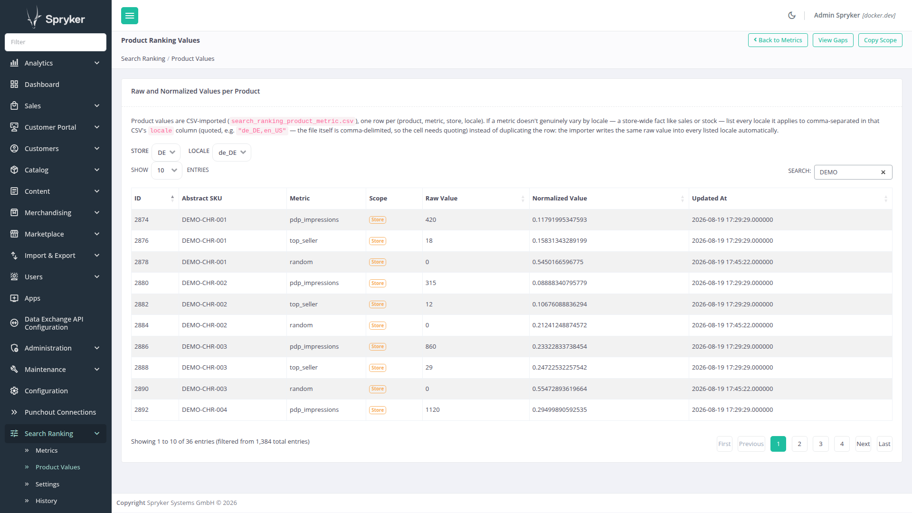
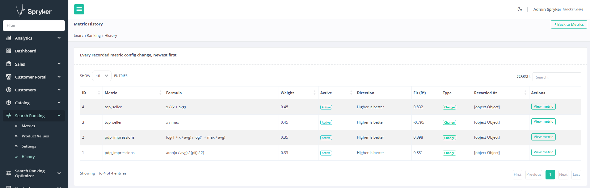
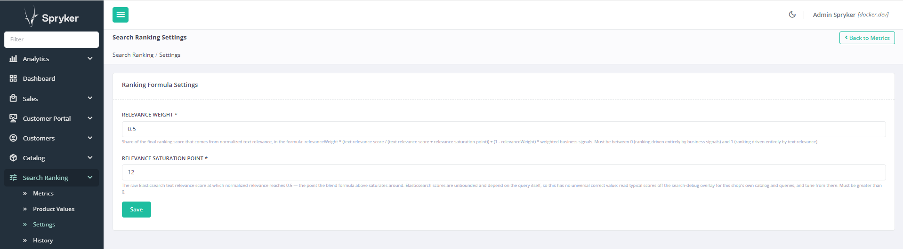

# Spryker Search Ranking

Data-driven search ranking for Spryker Commerce OS: rank search results by **business signals**
(PDP impressions, sales, or anything else you can measure) instead of relying on string matching
alone. Based on Spryker's
[data-driven ranking best practice](https://docs.spryker.com/docs/pbc/all/search/latest/base-shop/best-practices/data-driven-ranking).

Designed as the companion package to
[spryker-community/search-debug](https://github.com/andrebarthelmeshellmuth/spryker-search-debugger) —
the eventual `function_score` ranking is meant to stay fully inspectable in the search-debug overlay.

The standout piece: a data-driven normalization-authoring GUI. As you type a formula, the server
evaluates it against the metric's own real distribution and draws the curve live, alongside ranked
closed-form curve-fit suggestions — no guessing what shape a business signal should take:


*Part of the [Search Relevance](https://search-relevance.dev/) project — explore the interactive ranking-formula walkthrough there.*

## Contents

- [Terminology](#terminology)
- [Status](#status)
- [Before you start: this needs real business-signal data](#before-you-start-this-needs-real-business-signal-data)
- [What it does](#what-it-does)
- [Ranking formula](#ranking-formula)
- [Specificity-aware relevance weighting (opt-in)](#specificity-aware-relevance-weighting-opt-in)
- [Why full republish, not a partial score-only ES update](#why-full-republish-not-a-partial-score-only-es-update)
- [Why hourly batch normalization, not an immediate per-value hook](#why-hourly-batch-normalization-not-an-immediate-per-value-hook)
- [Normalization formulas](#normalization-formulas)
- [Modules](#modules)
- [Requirements](#requirements)
  - [Search engine compatibility](#search-engine-compatibility)
- [Installation](#installation)
  - [1. Install the package](#1-install-the-package)
  - [2. Register the core namespace](#2-register-the-core-namespace)
  - [3. Register the console commands](#3-register-the-console-commands)
  - [4. Register the data import plugins](#4-register-the-data-import-plugins)
  - [5. Add the import entities to your data-import YAML](#5-add-the-import-entities-to-your-data-import-yaml)
  - [6. Translations for the Zed GUI](#6-translations-for-the-zed-gui)
  - [7. Register the Zed navigation entry](#7-register-the-zed-navigation-entry)
  - [8. Schedule the normalization cron](#8-schedule-the-normalization-cron)
  - [9. Register the Elasticsearch export plugins](#9-register-the-elasticsearch-export-plugins)
  - [10. Register the package's search schema directory](#10-register-the-packages-search-schema-directory)
  - [11. Register the ranking-configuration sync queue](#11-register-the-ranking-configuration-sync-queue)
  - [12. Register the ranking-configuration publish event listener](#12-register-the-ranking-configuration-publish-event-listener)
  - [13. Register the function_score query expander](#13-register-the-function_score-query-expander)
  - [14. Optional: register the search-debug overlay section](#14-optional-register-the-search-debug-overlay-section)
  - [15. Schedule the scope-copy-sync cron](#15-schedule-the-scope-copy-sync-cron)
  - [16. Build](#16-build)
  - [17. Verify the installation](#17-verify-the-installation)
- [Import file formats](#import-file-formats)
- [Limitations](#limitations)
- [Testing and CI](#testing-and-ci)
  - [Automated checks](#automated-checks)
  - [Test suite](#test-suite)
- [License](#license)
- [Acknowledgements](#acknowledgements)

## Terminology

A quick reference for terms this README reuses across many sections. Each is explained in full where
it's first introduced in context — this is a lookup index, not a replacement for those explanations.

### metric

A named business signal (e.g. `pdp_impressions`, `top_seller`) with its own weight, normalization
formula, active flag, and direction. See [What it does](#what-it-does).

A metric's fields have two different scopes, not one: `name`/`isHigherBetter` (direction) are global —
the same everywhere the metric exists at all, since they're definitional (what the metric IS/MEANS).
`formula`/`isActive`/curve `shape` are STORE-scoped (`spy_search_ranking_metric_store_config`, one row
per metric × store) — a business-behavior signal like `pdp_impressions` is a store-level reality
(conversion/stock/warehouse facts), not a language preference, so it's deliberately NOT split further by
locale. `weight` is scoped one level finer still, per (store, locale) — a tuning DECISION, reasonable to
let vary by locale even where the underlying business data doesn't. A brand-new store gets its own
formula/active/shape via the Scope Copy page's Sync Store Config action (see [What it does](#what-it-does)),
not a database migration — the columns that once held a single global formula/isActive/shape on
`spy_search_ranking_metric` itself were removed entirely once every part of this package migrated onto
the store-scoped table (a breaking change; see [CHANGELOG](CHANGELOG.md) for the release that shipped it).

### weight

How much one metric's signal contributes to the combined business-signal score, relative to the other
active metrics. See [Ranking formula](#ranking-formula).

### raw value / normalized value

The real-world number for one metric on one product (e.g. "8,250 impressions"), and the `]0;1]` value
its formula maps that number to. See [What it does](#what-it-does).

### signal

A metric's own normalized value — used interchangeably with "metric" once normalization, not the raw
real-world number behind it, is the topic.

### digest

A metric's precomputed distribution snapshot — min/max/mean/median plus a 101-point percentile/empirical-CDF
backbone — rebuilt by the normalization cron and read by the normalization-authoring GUI's live preview
and curve-fit suggestions, so neither ever touches the raw per-product rows directly. See
[What it does](#what-it-does).

### relevanceWeight

Shorthand `α`. The single knob for how much of the final score comes from normalized text relevance vs.
the combined business-signal score. See [Ranking formula](#ranking-formula).

### relevanceSaturationPoint

Shorthand `k`. The raw Elasticsearch `_score` at which normalized relevance reaches exactly 0.5 — a
search-infra tuning constant, not a business knob. See [Ranking formula](#ranking-formula).

## Status

Feature-complete: business-signal search ranking, including the normalization-authoring GUI's
data-driven curve-fitting workflow.

Verified: dependency floors resolved and checked at their oldest allowed versions (`composer
check-floors`), the ranking formula's `function_score`/`script_score` cross-validated across three
engines and two Lucene generations (see [Search engine compatibility](#search-engine-compatibility)), 196
tests, phpcs and phpstan level 8 clean.

This package's own mechanism is complete: the metric/value data model, the Zed management UI, CSV data
import, the normalization cron, the export of normalized signals into the Elasticsearch page documents
(`scores` field), the **`function_score` ranking itself**: catalog searches are re-scored by
`relevanceWeight × normalizedRelevance + (1 - relevanceWeight) × Σ weightᵢ × signalᵢ`, with the metric
weights and the two blend constants editable in Zed and synchronized to key-value storage — see
[Ranking formula](#ranking-formula) for the full rationale — and a **data-driven normalization-authoring
GUI**: a live preview of the typed formula against the metric's own real distribution, plotted alongside
the theoretical max-discrimination reference curve, with ranked closed-form curve-fit suggestions.

This package deliberately scopes itself to *using* business signals to rank — deciding what the weights
*should* be (tuning, evaluation, calibration) is a different concern. Nothing here depends on that
decision being automated; a separate layer could reasonably be built on top of this one later without
requiring any change here.

## Before you start: this needs real business-signal data

Installing and wiring this package is not, by itself, enough to change a single search result's rank. It
is a mechanism that blends **normalized business-signal values** into the query score — with no imported
values for a metric, that metric has nothing to contribute, and the blend degrades quietly, not loudly:

- **A metric with a non-zero configured weight but zero imported raw values** (nobody has ever run
  `search-ranking:import` or the metric's data-import CSV for it) never gets normalized —
  `ProductMetricNormalizer::normalizeMetric()` checks `getMetricStatistics()`'s row count first and
  returns immediately when it's zero, so the metric's `scores.<name>` field is simply never populated in
  the product documents. At query time, `FunctionScoreBuilder`'s painless script guards every signal read
  with `doc.containsKey(...) && doc[...].size() > 0 ? value : 0` — a missing field contributes exactly
  `0`. Because that `0` is uniform across every product, it doesn't change relative order at all: the
  blended score reduces to `relevanceWeight × normalizedRelevance` for every hit alike, which — since the
  saturating curve is monotonic in `_score` — sorts identically to plain text relevance. **The formula
  runs, the weight is configured, nothing errors, and the ranking looks exactly like this package was
  never installed.** There is no warning anywhere in the Zed GUI today that a configured metric has zero
  underlying data.
- **When *no* active metric has a non-zero weight at all**, `FunctionScoreBuilder::build()` returns `null`
  and `SearchRankingFunctionScoreQueryExpanderPlugin` leaves the query untouched — the plain, unwrapped
  text-relevance query runs instead. This case at least is documented (see the plugin's own docblock) and
  costs nothing extra at query time, unlike the previous case.

**In short:** import (or organically accumulate, e.g. via `spryker-community/search-ranking-optimizer`'s
own metric-writing hooks) real per-product values for every metric you give a non-zero weight, and run the
normalization cron, *before* judging whether the ranking formula is doing anything. A fresh install with
default demo weights and no imported data will rank exactly like stock Spryker search — indistinguishably
so, with no error to tell you why.

## What it does

- **Ranking metrics** (`spy_search_ranking_metric`): named business signals (e.g. `pdp_impressions`,
  `top_seller`, `random`) with a **weight** for their contribution to the combined score, an
  **active** flag, a **normalization formula** stored as an expression string, and a **direction** flag
  (`isHigherBetter`) — whether a higher raw value is the better outcome (sales, impressions) or a lower
  one (days-since-restock, return rate). Direction is business knowledge that cannot be inferred from the
  data; it only steers which curve-fit suggestions the normalization GUI offers below, never the formula
  itself.
- **Product values** (`spy_search_ranking_product_metric`): one row per (metric, abstract product)
  pair holding the **raw real-world value** (e.g. "8,250 impressions") and the **normalized value
  in ]0;1]** derived from it. Unique per pair, removed by cascade with either parent.
- **Metric history** (`spy_search_ranking_metric_history`): every time a metric's formula, weight,
  active flag or direction actually changes — via the Zed edit form, or any other process that saves
  through the facade — a snapshot is appended: the new config, the metric's [digest](#digest) at that moment
  (min/max/mean/median/percentiles, null if none existed yet), and the new formula's R² against that
  digest. Append-only, never updated; deliberately **not** a hard foreign key to the live metric row, so
  history outlives a later rename or deletion. A save that changes nothing (a re-submitted, unmodified
  form) writes no row — this is a change log, not an access log. `metricName` is denormalized for the
  same outlive-the-live-row reason.

  The `isChange` flag on every row (always `true` for the writer that populates it) exists for a
  specific reason: a periodic drift-detection job should compare a metric's CURRENT digest against the
  digest **as of its last real change**, not merely against last month's snapshot — otherwise the
  comparison window silently resets every period regardless of whether anything happened, and gradual
  multi-month drift can stay invisible because each individual month-over-month delta looks small.
  Concretely: if a monthly check finds the fit still adequate at 30 days and changes nothing, the *next*
  check should compare against the 30-day-old baseline grown to 60 days, not reset to "vs. 30 days ago"
  again — `isChange` is what lets that job find the right anchor point (the newest row where `isChange =
  true`) instead of just the newest row. A check-only run (fit still fine, nothing changed) would append
  its own row with `isChange = false`, extending the timeline without moving the anchor.

  Three read-only primitives on `SearchRankingFacade` exist specifically for a drift-detection job like
  that to build on, without it needing any direct database access of its own: `findLastMetricChangeHistoryEntry()`
  (the anchor row above), `evaluateCurrentMetricFit()` (a fresh, side-effect-free "how well does this
  metric's CURRENT formula fit its CURRENT digest right now" read — never writes a history row, safe to
  call as often as needed), and `recordCheckOnly()` (appends the `isChange = false` row itself once a
  check has run). This package makes no decision about thresholds, schedules, or notifications with
  them — that policy is deliberately somebody else's job to build on top.
- **Zed UI**:

  

  Every scoped page below (Metrics, Product Values, Product Value Gaps, Settings) has an explicit
  **Store + Locale selector** at the top — a plain GET dropdown pair, not a Symfony form, since it's a
  view filter rather than a mutating action. Whichever scope is selected carries through create/edit/
  delete links and save actions on that page, so an admin explicitly picks which store's config they're
  looking at rather than it being implicit from a session-level "current store."

  - `/search-ranking-gui` — metric list with create/edit/delete. Formulas are validated on save by
    trial evaluation; the exact parser error is shown on the form. Metric names are checked for
    uniqueness. Deletion is a CSRF-protected POST.
  - `/search-ranking-gui/product-metric` — read-only, searchable table of all product values
    (abstract SKU, metric, raw value, normalized value, last update).

    
  - `/search-ranking-gui/product-metric-gap` (linked from the Product Values page's "View Gaps" button)
    — a read-only, searchable table of every (product abstract, active metric) pair with **no
    `spy_search_ranking_product_metric` row at all** — never imported, or imported then deleted. With
    *N* products and *M* active metrics, `N × M` rows is the fully-covered baseline; this page is where
    that gap actually becomes visible, instead of being invisible inside a
    `spy_search_ranking_product_metric` table that simply has fewer rows than expected. Defaults to
    gaps across **every** active metric (SKU + which business score is missing); the dropdown narrows
    to one metric at a time.

    **Raw SQL, deliberately** — the one query in this whole package that isn't built through Propel's
    ActiveQuery. This needs either a `UNION` of one query per active metric, or a genuine `CROSS JOIN`
    between `spy_search_ranking_metric` and `spy_product_abstract` — two tables with no direct relation
    between them; every real relation here runs through `spy_search_ranking_product_metric`'s own two
    foreign keys, which is exactly right (a metric applies to many products, a product has many
    metrics — that association, and the value it carries, belongs entirely to the junction table, not
    to either side directly). Propel 2.0 (what this project runs) has no `UNION` support at all in its
    query builder, and a `CROSS JOIN` has no declared relation for Propel's generated `joinX()` methods
    to hang off. Given the real scale here (a shop with thousands of products and a handful of metrics —
    tens of thousands of combinations, not millions), a hand-rolled `CROSS JOIN` in raw SQL was the
    simpler and more honest choice over reusing the single-metric `LEFT JOIN` once per active metric and
    merging the results in PHP (which would have stayed inside Propel, at the cost of losing real
    database-level pagination and sorting across the merged set). Every value that varies per call is
    bound as a parameter; `$sortColumn`/`$sortDirection` are resolved through a fixed whitelist, never
    interpolated from caller input directly — see `ProductMetricGapFinder`'s own docblock.
  - `/search-ranking-gui/metric-history` — read-only, searchable, newest-first table of every row in
    `spy_search_ranking_metric_history`: the metric name and formula at that point in time, weight,
    active flag, direction, the formula's R² fit against the digest at that moment (a dash when no
    digest existed yet), and whether the row is a real change or a check-only snapshot (see `isChange`
    above). Each row links back to the live metric's edit page via its `fkSearchRankingMetric` (the
    metric itself may since have been renamed or deleted — the link simply 404s in that case, since the
    history row intentionally keeps no hard foreign key). No filtering by metric or date range yet; add
    a `?id-search-ranking-metric=` query-string constraint here if that becomes necessary once the table
    grows.

    
  - **Normalization-authoring preview** (on the metric edit page): as you type a formula, a debounced
    request asks the server to evaluate it at ~100 sample points spanning the metric's own real
    distribution (never a JS reimplementation of the expression-language math) and draws the resulting
    curve as an inline SVG, alongside the **empirical CDF** — the theoretical max-discrimination
    normalizer (map each raw value to the fraction of products below it) — as a reference line. Below the
    plot, ranked **curve-fit suggestions** (`atan(x/k)`, `x/(x+k)`, `log(1+x/k)/log(1+max/k)`, `pow(x/max,
    p)`, a sigmoid, linear, and — for `isHigherBetter=false` metrics — an `exp(-x/tau)` decay) show how
    closely each closed-form shape tracks that empirical CDF (R²), with a one-click "use this formula"
    action. The best fit is a data-driven *default*, never imposed — a metric can have a legitimate
    business reason (e.g. a rating signal where only 4.5★+ should approach 1) to deviate from the
    statistically "ideal" spread. Whichever candidate's formula the saved one byte-for-byte matches (both
    are deterministic functions of the same digest, so a genuine match reproduces exactly) has its stable
    family slug (`atan`, `sigmoid`, `hyperbolic`, ...) persisted onto the metric's own `shape` — silently
    `null` for a freeform/custom formula that matches no offered candidate. This is derived bookkeeping,
    not something to set directly: it exists so on-top tooling can tell "still the same curve family,
    just re-fitted" apart from "a materially different shape was chosen" without re-parsing formula
    strings.
- **Data import**: importer types `search-ranking-metric` (upsert by name) and
  `search-ranking-product-metric` (resolves metric name + abstract SKU to foreign keys, writes raw
  values only — normalized values are never imported). Both writer steps go straight to Propel rather
  than through `SearchRankingFacade` — the standard Spryker DataImport convention, needed since a
  per-row facade call would add mapping/validation/transaction overhead on top of what the
  batch/transaction machinery around each step already does. The one real consequence: importing a
  metric this way skips the formula validation and history recording `saveMetric()` normally does, so a
  malformed formula in a CSV row surfaces later — as a per-metric skip reported by the next
  `search-ranking:normalize` run — rather than failing the import immediately. The metric NAME is the one
  exception: it's validated immediately and fails the import row (not deferred like the formula), since a
  name `FunctionScoreBuilder` doesn't recognize as a safe painless-script identifier would otherwise
  silently never contribute to live ranking while still consuming weight-normalization budget and still
  rendering as a live contribution in the search-debug overlay. The product-metric
  importer has no such gap: there's no facade-level "save one product metric" method it bypasses, this
  direct upsert is the only path that data ever takes.
- **Normalization cron**: `vendor/bin/console search-ranking:normalize` recalculates every
  normalized value of every active metric **except the random tie-breaker metric** (see below), for
  **every store×locale**, in batches. A metric whose formula fails to evaluate is skipped and reported
  (non-zero exit code) without aborting the run for the other metrics. As a byproduct, it also rebuilds
  each active metric's **distribution digest** (`spy_search_ranking_metric_digest`) per scope:
  min/max/mean/median plus a 101-point empirical-CDF backbone (percentiles 0, 1, 2, ..., 100), computed by
  sorting that metric's raw values once — this is the data the normalization-authoring preview above
  reads, so it never has to touch the raw per-product rows directly, however many there are. Optional
  `--store=X`/`--locale=Y` restrict a run to one scope; omitting either processes every store, or every
  locale available for the selected store(s) — the default, unfiltered behavior is unchanged from before
  this package was store/locale-scoped at all.
- **Random tie-breaker cron**: `vendor/bin/console search-ranking:randomize` is a separate, nightly
  command that reshuffles ONE metric — the one configured as the random tie-breaker
  (`SearchRankingConfig::getRandomMetricName()`, `random` by default) — for every store×locale where it
  exists and is active, and republishes affected products once at the end, on its own cadence, independent
  of the hourly normalize run above. It is a deliberate no-op (exit 0, no work done) for a scope where that
  metric does not exist or is not active, so it is always safe to keep scheduled regardless of whether the
  metric happens to be turned on everywhere. Kept separate from the hourly cron because reshuffling a
  tie-breaker every hour would make search result order visibly churn for a shopper who searches again
  shortly after — nightly is frequent enough to keep ties from calcifying into a permanent order without
  looking unstable. Also accepts `--store`/`--locale`, same semantics as `:normalize` above. Reuses the
  same full-republish path as every other score update; see
  [Why full republish, not a partial score-only ES update](#why-full-republish-not-a-partial-score-only-es-update).
- **`search-ranking:check-compatibility`**: probes the live search engine's ACTUAL capabilities —
  never a version-string comparison, since OpenSearch and Elasticsearch report incompatible version
  identifiers under the same API surface (this stack self-reports `distribution: opensearch, 1.3.4`; a
  bare Elasticsearch cluster reports a version number with no `distribution` field at all). Fires
  `_validate/query` cluster-wide for each construct this package uses, or could plausibly use later
  (`function_score` + `script_score`, `rank_feature`, `distance_feature`, `pinned`) and a
  deliberately incomplete `_rank_eval` request to check whether that endpoint is recognized at all,
  reading back the engine's own parser response either way rather than trusting a claimed version.
  Read-only — every probe only asks "would the engine accept this?", it never touches real documents or
  indices. Exits non-zero only if `function_score` + `script_score` is unsupported (the one construct the
  ranking itself actually depends on); every other probed capability is purely forward-looking and never
  affects the exit code, only the printed report.
- **Elasticsearch export**: the package ships a `page.json` fragment defining a dynamic `scores`
  object field (per Spryker's data-driven-ranking best practice) and a ProductPageSearch plugin trio
  — bulk data loader, data expander, map expander — that writes each product's normalized values
  into its page document as `scores: {metricName: value}`. Products without values get no `scores`
  field. After normalizing, the cron triggers `Product.product_abstract.publish` events (chunked)
  for all scored products so the documents refresh; `--skip-publish` suppresses that — a full
  product-page republish rather than a partial score-only write, deliberately; see
  [Why full republish, not a partial score-only ES update](#why-full-republish-not-a-partial-score-only-es-update).
- **function_score ranking**: a `QueryExpanderPlugin` wraps the catalog search query in a
  `function_score` with the painless script
  `params.relevanceWeight * (_score / (_score + params.relevanceSaturationPoint)) + (1 - params.relevanceWeight) * (params.w0 * doc['scores.metric'] + …)` —
  `boost_mode: replace`, weights and both blend constants as script params, every doc-value access
  guarded against missing fields, and metric names validated against a strict pattern before being
  embedded (import data cannot inject script code). See [Ranking formula](#ranking-formula) for why
  it's shaped this way. It only acts on queries **with a search string** (category/browse pages keep
  their ordering) and silently steps aside when no configuration is synchronized or no active metric
  has a non-zero weight.
- **Ranking configuration in key-value storage**: active metric weights + the two blend constants
  ([`relevanceWeight`](#relevanceweight), [`relevanceSaturationPoint`](#relevancesaturationpoint)) live
  in **one dictionary document per (store, locale)** (`kv:search_ranking_configuration:{store}:{locale}`,
  lowercased), published from Zed through a storage table with the `synchronization` Propel behavior's own
  `store`/`locale` parameters. Metric CRUD, the settings form, and the cron all republish **every**
  store×locale document in one pass (mirroring the same store-outer/locale-inner fan-out
  `ProductMetricNormalizer` already uses) — there is no way to publish just one scope's document from the
  Zed side, since a save on any one scope's config doesn't imply the others are stale, but republishing
  everything is cheap enough not to bother optimizing. Both blend constants are Zed-editable at
  `/search-ranking-gui/settings`, scoped per (store, locale) via that page's own Store+Locale selector.
  Metric weights are **normalized to sum to 1 at publish time, independently per scope**
  (`RankingConfigurationStorageWriter`) — see [Ranking formula](#ranking-formula) for why. The raw values
  in `spy_search_ranking_metric_weight` are untouched; only each scope's published copy is normalized.
- **search-debug overlay integration** (optional, needs
  [spryker-community/search-debug](https://github.com/andrebarthelmeshellmuth/spryker-search-debugger)):
  `SearchRankingProductDebugDataExpanderPlugin` adds a "Business signals" section to the per-product SRP
  overlay — one `signal × weight = contribution` line per metric and their total — plus, distributed
  across a few other dedicated spots in the same overlay (not all bundled into that one section): the
  saturation point (`k`), grouped under "Text signals" with the raw text-match score it normalizes; the
  normalized relevance it produces (`score/(score+k)`), labeled "Text Signal total"; the relevance weight
  (`α`); and the full blend formula, e.g. `0.60 × 0.37 + (1 - 0.60) × 0.53 =`, reconciling exactly with
  the final score shown directly below it. The formula plugs in the already-shown "Text Signal total"
  value directly rather than repeating `score / (score + k)` inline, and spells out `(1 - α)` literally
  instead of pre-subtracting it into a single number, so it stays visibly tied to the `α` line just
  above it. Every number here is rounded to
  `SprykerCommunity\Shared\SearchDebug\SearchDebugConfig::SCORE_DECIMAL_PLACES` (default **3**) — the
  same constant search-debug's own overlay numbers use, so the whole page shows one consistent
  precision; see that package's README for details. Rounding happens only at this display step — the
  underlying floats used for the actual ranking calculation stay full-precision throughout.
- **Scope Copy** (`/search-ranking-gui/scope-copy`) — bootstraps a newly expanded market from an
  established one. Copies every metric weight and setting **explicitly saved** for a source (store,
  locale) onto a target scope; a metric/setting never touched in the source stays untouched in the
  target too, rather than writing an explicit copy of its code-level default.
  `spy_search_ranking_product_metric`/`_metric_digest` — real, scope-local behavioral data — are never
  copied, so a freshly bootstrapped market still shows its own honest gaps on the Product Value Gaps page.
  Blocked by default when the target scope already has any saved configuration; an "Overwrite existing
  target configuration" checkbox is required to proceed. Every copied metric weight is recorded on
  [Metric History](#what-it-does) tagged `scope_copy`, alongside the existing `manual`/`auto_tune`/
  `optimizer_apply`/`checkpoint_restore` sources.

  Two actions:
  - **Copy now** — a one-off copy, no lasting relationship.
  - **Lock** — copies immediately, then persists the pairing so the daily `search-ranking:scope-copy-sync`
    cron keeps re-copying source → target every day, until unlocked. Enforced at creation time so the
    database can never hold an invalid pairing: a scope may be the **target of at most one active lock**
    (unambiguous which source feeds it), the **source of many active locks** (one mature market can seed
    several new ones), and never simultaneously a source and a target. This is a point-in-time check
    against **active** locks only, not a lifetime tag — a scope freed by unlocking is eligible for either
    role again in a future lock. Unlocking soft-deletes the row (never hard-deleted) so the Active Locks
    table stays a real history of every lock episode; relocking the same pair later creates a fresh row
    rather than reactivating the old one.

  **Sync store configuration** (same page, below the copy/lock actions above) — a separate, **store-only**
  action for a metric's `formula`/`isActive`/curve `shape`, since those are store-scoped, not
  (store,locale)-scoped like weight/settings (see [Terminology](#terminology)'s own `metric` entry for the
  store-vs-(store,locale) scoping background). Uses the SAME source/target Store pickers above it (their
  locale is only used as a lens to re-detect each copied metric's `shape` against its own real digest — `shape` is never carried over
  verbatim, so a target with no digest yet correctly ends up with `shape=null` even though its `formula` was
  copied). Two modes:
  - **Mirror** (default) — copies every metric the source store has explicitly configured, creating a row
    for one the target has never configured at all. Matches the copy/lock actions' own bootstrap
    philosophy above.
  - **Copy only metrics the target already has** — conservative, opt-in: a metric the target has never
    independently configured is left alone rather than created. The resulting overlap can end up smaller
    than the source's own metric set — the page reports how many metrics were skipped.

  Blocked by default when the target store already has any saved store configuration (same "Overwrite
  existing target store configuration" checkbox pattern as above). Every synced metric is recorded on
  [Metric History](#what-it-does) tagged `scope_copy`, fanned out across every real locale of the target
  store, same as any other formula change (see the store-scoped-formula migration's own history-fan-out
  design, project memory). **One-off only** — unlike weight/settings, there is no lockable/daily-synced
  variant of this action; formula/curve-shape tuning changes far less often than weight in practice.

## Ranking formula

The final ranking score blends normalized text relevance and the weighted business signals:

```
relevanceWeight × (_score / (_score + relevanceSaturationPoint)) + (1 - relevanceWeight) × Σ weightᵢ × signalᵢ
```

Both `relevanceWeight` and `relevanceSaturationPoint` are Zed-editable at
`/search-ranking-gui/settings` and synced to key-value storage like the metric weights.



**Why not just multiply, e.g. `(1 + sqrt(_score)) × (signals + baseline)`?** An earlier version of
this package did exactly that, with an additive `signalBaseline` constant keeping products without
business signals from being multiplied towards zero. The problem: Elasticsearch's raw `_score` is
unbounded and query-shape-dependent — a query matching more terms, or rarer terms, produces a much
higher score than one matching a single common term, with no ceiling — while business signals are
normalized to `[0;1]` by design. Combining an unbounded, query-dependent number with a bounded one
directly means the *relative* influence of business signals over text relevance drifts unpredictably
from query to query, and the additive baseline has no principled value — it's tuned by eye until
results look right.

That said, the old formula wasn't all bad: `sqrt(_score)` never saturates, it keeps growing (slowly) as
`_score` grows, so on long, specific queries where many rare terms match and `_score` gets large, weight
naturally drifted back toward text relevance instead of staying pinned to the business signals — a
property the saturating curve below deliberately gives up, since it caps `_score`'s contribution at
`[0;1)` no matter how large `_score` gets. Recovering that upside on purpose, rather than as a side effect
of an otherwise unpredictable formula, needs real additional machinery — some way to read how specific a
query's own text is. [Specificity-aware relevance weighting](#specificity-aware-relevance-weighting-opt-in)
below is exactly that machinery, opt-in and off by default, built for a related but distinct purpose
(deciding how much a query should lean on business signals at all, not recovering this specific upside) —
the general shape of what "reading the query" looks like in this package now exists, even though it
doesn't reintroduce the old formula.

**`relevanceWeight` and `relevanceSaturationPoint` fix that by normalizing first.**
`_score / (_score + relevanceSaturationPoint)` is the same saturating-curve shape BM25 itself uses for
term-frequency saturation (also known from Michaelis-Menten kinetics): it maps the unbounded `_score`
onto `[0;1)`, reaching exactly 0.5 when `_score == relevanceSaturationPoint`. With both sides of the
blend now on the same `[0;1]` scale, `relevanceWeight` becomes one single, interpretable knob — "how
much of the final score comes from text relevance vs. business signals" — rather than an implicit
multiplicative interaction plus an unexplainable additive constant.

The two constants play different roles operationally:
- **`relevanceWeight`** is a **business knob**. It's a genuine 0–1 tradeoff someone might reasonably
  A/B test — how much should business performance move the needle relative to text match.
- **`relevanceSaturationPoint`** is a **search-infra tuning constant**. It has no universal correct
  value — it depends entirely on this shop's own field boosts and typical query shapes. It should be
  set once from real `_score` values (the search-debug overlay's "Text match raw score" line is
  exactly the number to sample) and rarely touched afterwards, not guessed.

**Default `relevanceWeight` is `0.75`, not a neutral `0.5`.** Two reasons, both rooted in the
multiplicative-formula history above: (1) the old `(1 + sqrt(_score)) × (signals + baseline)` shape gave
text relevance an *unbounded* multiplier — for this catalog's typical scores (roughly 4-20, see
`relevanceSaturationPoint` above), that term swung roughly 2x-5x across weak-to-strong matches, so text
relevance was structurally dominant in practice, not a 50/50 partner with business signals. A flat `0.5`
split on the current (correctly bounded) formula would be a real behavior change, not a like-for-like
fix — it under-weights text relevance relative to what this package used to do. (2) it matches
established field guidance (e.g. Turnbull & Berryman, *Relevant Search*): text relevance should stay the
*primary* ranking signal, with business/popularity signals refining and tiebreaking rather than competing
as an equal partner — an equal-weight blend risks letting a popular-but-off-target result outrank an
exact/obviously-right match, a common and easily user-visible relevance failure. This is still a starting
point, not a measured optimum — this package deliberately scopes itself to *using* business signals to
rank, not deciding what the weights *should* be (see [What it does](#what-it-does)); an `nDCG`-style
evaluation against real rated queries, run by separate tooling on top of this one, is one principled way
to validate or refine this value once enough ratings exist.

One practical constraint shaped this design: `script_score` inside `function_score` runs *per
document*, with no visibility into the score distribution of the other candidates in the result set.
A saturating function only ever needs the current document's own `_score`, so it drops into the
existing single-pass query without any architecture change — true min-max/percentile normalization
across the whole candidate set would need a two-stage rescore pipeline instead.

One visible consequence: the final `_score` is now always in `[0;1]` (a weighted blend of two `[0;1]`
terms), rather than the "few units" range the old multiplicative formula produced — purely cosmetic,
not a ranking-correctness change.

**The business-signal term also needs to genuinely stay in `[0;1]` for any of this to hold — which
depends on the metric weights, and those are Zed-editable with no upper bound.** The metric form only
constrains a single weight to be `>= 0` (see `MetricForm`); nothing stops an admin from giving three
active metrics a weight of 1.0 each, which would let `Σ weightᵢ × signalᵢ` reach 3 and swamp
`relevanceWeight`'s intended meaning. The fix: **active metric weights are normalized to sum to 1
before publishing** (`RankingConfigurationStorageWriter::normalizeMetricWeights()`) —
`usedWeightᵢ = enteredWeightᵢ / Σⱼ enteredWeightⱼ`. Since each metric's own normalized signal is
already clamped into `]0;1]`, and the used weights now sum to exactly 1, `Σ usedWeightᵢ × signalᵢ` is a
genuine **convex combination** of values already inside `]0;1]` — guaranteed to stay in that interval,
not just usually fine. With a single active metric this always normalizes to 1 regardless of the raw
number entered (it's 100% of the active-weight sum either way); with several, e.g. `top_seller = 3.0`
and `pdp_impressions = 1.0` both active, they publish as `0.75` and `0.25`. Normalization happens once,
at publish time — not independently in `FunctionScoreBuilder` and `ScoreSectionBuilder` — so the live
ranking query and the search-debug overlay can never silently disagree on the numbers, and the debug
overlay's `signal × weight = contribution` lines show the real, effective weight actually used, not
whatever raw number was typed into the Zed form. All-zero (or zero active metrics) is left as-is rather
than dividing by zero — `FunctionScoreBuilder` already treats that as "no usable business signal" and
steps aside to pure text relevance.

## Specificity-aware relevance weighting (opt-in)

**Off by default.** A single global `relevanceWeight` is a reasonable default, but it can't tell an
exact-SKU-style query ("SKU-12345", a query whose own text is already unambiguous) apart from a
category-style query ("office chairs", a query so generic that business signals are what should actually
decide the order). This feature derives `relevanceWeight` per query instead of using one static value for
every search.

**An earlier version of this feature measured the SHAPE of the top-N `_score` distribution (Shannon
entropy) instead — that approach was replaced.** Verified live against this package's own real catalog: an
ordinary multi-term/browsy query's top-10 raw BM25 `_score`s cluster within roughly 7% of each other
regardless of how generic the query actually is, so normalized entropy came back ≈`0.9998` — numerically
indistinguishable from the theoretical maximum — for nearly every query tried, browsy or not. Only a
literal single-hit query ever produced a meaningfully different reading. In other words, entropy over
`_score` was measuring "did this query match more than one document," not "how specific is this query,"
so it couldn't actually grade the "somewhat vs. very generic" middle ground the feature exists for.

**The mechanism now measures the QUERY TEXT itself, not the resulting scores.** With the flag enabled,
`SprykerCommunity\Client\SearchRanking\Search\SpecificityWeightCalculator` fires ONE ADDITIONAL,
lightweight `_termvectors` probe per catalog search — an artificial document containing the search string,
probed against the same fields the real query searches (with `per_field_analyzer` forcing the SAME
search-time tokenization the real query uses, since `_termvectors` otherwise defaults to a field's
INDEX-time analyzer) — never a real catalog query at all, unlike the entropy-era probe this replaces. From
the response it reads each query term's real corpus document frequency (`doc_freq`) and corpus size
(`N`), derives `idf = ln(N / doc_freq)` per term (a term with zero real corpus evidence is skipped, not
treated as maximally specific), and blends the terms into one raw specificity value:

```
rawSpecificity = specificityBlendWeight × max(idf) + (1 − specificityBlendWeight) × harmonicMean(idf)
```

`max` alone would reward a single rare term even in an otherwise generic query (e.g. a SKU trailing a
common word); `harmonicMean` alone would punish a query as soon as ANY term is common, even alongside a
very rare one. Blending the two (default `specificityBlendWeight = 0.7`, favoring `max`) keeps a query
with one genuinely rare term reading as specific, while still letting an all-common-words query read as
unspecific. Real, verified idf values from this package's own catalog (`N = 1064`, `ln(N/df)`): `office`
→ `0.68`, `office chair` → `2.33`, `chair` → `2.86`, `topstar chair` → `3.57`, `topstar` → `3.71`,
`topstar M11480` → `5.79`, `M11480` (an exact SKU) → `6.28` — a sensible, continuously-graded ordering
from generic to specific, unlike the old entropy signal's two-extremes-only behavior.

The unbounded `rawSpecificity` is then normalized into `[0;1[` the same saturating way `relevanceWeight`'s
own text-relevance term already is, generalized to a Hill/Michaelis-Menten curve:

```
normalizedSpecificity = rawSpecificity^curveExponent / (rawSpecificity^curveExponent + specificitySaturationPoint^curveExponent)
```

`curveExponent = 1.0` (the default) reproduces the original `rawSpecificity / (rawSpecificity +
specificitySaturationPoint)` formula exactly. At `rawSpecificity == specificitySaturationPoint` the result
is always exactly `0.5` for any `curveExponent > 0` — the pivot never moves, only how sharply the curve
transitions around it does. A `curveExponent` above `1.0` sharpens the transition (near-binary
specific-vs-unspecific); below `1.0` flattens it (more gradual grading across the whole range).

**The configured `relevanceWeight` is a baseline the specificity result shifts, never fully replaces.** A
highly specific query shifts it up toward text relevance, an unspecific/browsy query shifts it down toward
business signals, by up to a configured maximum in either direction; a query with average specificity
(`normalizedSpecificity` exactly `0.5`, i.e. raw specificity exactly at the calibrated saturation point)
leaves the baseline untouched:

```
signedDeviation = 2 × normalizedSpecificity − 1              // −1 at 0, 0 at 0.5, +1 at 1
shapedDeviation = sign(signedDeviation) × |signedDeviation|^exponent
relevanceWeight = clamp(configuredRelevanceWeight + shiftMagnitude × shapedDeviation, 0, 1)
```

The exponent is applied to the deviation's magnitude, not to `normalizedSpecificity` directly — that
keeps `0.5` an exact neutral point regardless of the exponent's value, rather than moving it.

> [!NOTE]
> **`field_statistics.doc_count` (the `N` in `ln(N/df)`) is index-wide across every locale, not
> locale-scoped** — `_termvectors` has no way to scope it to one locale. This is an accepted approximation:
> a shop indexing one page document per store-locale per abstract product has a uniform duplication factor
> across every product, so the constant multiplicative inflation of both `N` and `df` cancels out in the
> `ln(N/df)` ratio. If your shop has uneven per-product locale coverage, this approximation may not hold —
> verify against your own catalog before relying on it.

**Five Zed-editable settings, at `/search-ranking-gui/settings`** (alongside `relevanceWeight` and
`relevanceSaturationPoint` — see [Ranking formula](#ranking-formula)) — all only take effect once the
code-level flag below is on:
- **Specificity blend weight** (default `0.7`) — `specificityBlendWeight` (α) above. Also tunable via
  `spryker-community/search-ranking-optimizer`'s CMA-ES search.
- **Specificity saturation point** — `specificitySaturationPoint` (k) above. Calibration-tunable only
  (like `relevanceSaturationPoint`), not CMA-ES-tunable — see
  `spryker-community/search-ranking-optimizer`'s Calibration feature. Needs a real value sampled from your
  own catalog before trusting the default; a placeholder chosen without that data could be wildly wrong.
- **Specificity curve exponent** (default `1.0`) — `curveExponent` above, how sharply
  `normalizedSpecificity` transitions around the saturation point. Also tunable via
  `spryker-community/search-ranking-optimizer`'s CMA-ES search.
- **Specificity weight exponent** (default `1.0`) — how sharply the shift ramps up away from the neutral
  point.
- **Specificity weight shift magnitude** (default `0.25`) — the maximum shift in either direction. Sized
  to match the `0.75` `relevanceWeight` baseline: `shiftMagnitude = 1 - relevanceWeight`. A baseline above
  `0.5` has less headroom upward (toward `1.0`) than downward (toward `0.0`) before clamping;
  `relevanceWeight` itself cannot leave `[0;1]`, so this isn't a formula flaw, just where a bounded knob
  sitting near its own edge runs out of room. Sizing the magnitude to the *tighter* side means a maximally
  specific query (`normalizedSpecificity = 1`) reaches exactly `1.0` — pure text relevance — with no
  clamped/wasted resolution, while a maximally unspecific query (`normalizedSpecificity = 0`) floors at
  exactly `0.75 - 0.25 = 0.5`: the OLD global default, never lower. If you change the `relevanceWeight`
  baseline, re-derive this value as `1 - relevanceWeight` again rather than leaving it fixed.

**Why the ON/OFF switch is code-level, not one of the settings above:** it's the one control that decides
whether a second live `_termvectors` probe fires on every catalog search at all — flipping it should take
a project deploy, not just a Zed form save. Enable it in your project's
`Pyz\Client\SearchRanking\SearchRankingConfig` by overriding `isSpecificityWeightingEnabled(): bool` to
return `true`; the tuning settings become meaningful once that's done. **This is the only override point
that actually works** — `Shared\SearchRanking\SearchRankingConfig::isSpecificityWeightingEnabled()` is a
plain hardcoded `return false;`, not a project-overridable `AbstractSharedConfig`, so overriding a
`Pyz\Shared\SearchRanking\SearchRankingConfig` class has no effect. Other code that needs to ask whether
specificity weighting is live for this project — e.g. a different package reimplementing this formula for
its own evaluation tooling — should call `SearchRankingClientInterface::isSpecificityWeightingEnabled()`
rather than referencing either config class directly; it resolves through this same, genuinely
project-override-aware Client config.

**Also override `getSpecificityProbeFieldSearchAnalyzers(): array`** on the same Client config class if
your project's own `page.json` schema declares a custom search-time analyzer for its fulltext fields (this
package's own demo shop does, for synonym handling). The package's own default maps the two standard
Spryker fulltext fields to Elasticsearch/OpenSearch's built-in `standard` analyzer — safe on a vanilla
install, but almost certainly wrong once a project adds its own custom search-time analyzer, since
`_termvectors` would then tokenize differently than the real query does.

**Why it's opt-in at all:** it doubles the number of Elasticsearch/OpenSearch round trips per catalog
search. That's a real, permanent cost — worth it once you have a mixed catalog with both exact-match and
browsy query patterns, not worth paying on every search by default.

**Safety:** a failing or empty probe (no query term with real corpus evidence, a transient engine hiccup)
is caught and falls back to the configured static `relevanceWeight` unchanged — this feature can degrade
to "as if it were off" but never breaks or blocks the real search it's attached to. The same fallback
covers a KV-storage payload published before this feature existed: a project that enables the flag before
its first post-upgrade Zed save still gets sane defaults, not an exception.

**Visible in the search-debug overlay.** `SearchRankingFunctionScoreQueryExpanderPlugin` hands its
`SpecificityWeightingResult` off to `SearchRankingClient` (the one instance the Locator guarantees stays
the same across this package's plugins for the whole request), so
`SearchRankingProductDebugDataExpanderPlugin` can read the SAME result back later, when building the
overlay — not an independent, stale config lookup. Two effects:

- The overlay's "Relevance weight (α)" line and the closing combination formula use the per-query
  effective weight specificity weighting actually applied, not the static configured one — the formula
  stays reproducible-by-eye against the real final score even with specificity weighting on.
- A second "Specificity weighting" section appears (only when the feature actually ran for that query),
  directly above the "Relevance weight (α)" line it explains the shift for, listing the configured
  baseline, the measured normalized specificity, the shift, and the resulting effective weight — so the
  debug overlay explains *why* `relevanceWeight` moved, right next to its new value, not just the value
  itself elsewhere on the page.

## Why full republish, not a partial score-only ES update

After normalizing, the cron re-triggers the standard `Product.product_abstract.publish` event for every
scored product — the same full product-page export every other product change (price, stock, category)
already goes through — rather than writing just the changed `scores.*` values directly into Elasticsearch.
**We do full updates always for business score updates because:**

- **A partial ES update isn't actually cheap at the storage layer.** Lucene segments are immutable, so
  there is no such thing as patching one field of an existing document in place — Elasticsearch's own
  `_update` API internally does a read-modify-write: fetch the current `_source`, merge the given fields
  in, delete the old Lucene document, index a new one. The write cost on the Elasticsearch side is
  essentially the same as a full document replace either way. Whatever is saved by "only touching scores"
  is saved entirely on the **Zed side** (skipping the Propel queries and the other `ProductPageSearch`
  plugins for price/images/categories/stock), not on the Elasticsearch side.
- **The publish/queue pipeline's resilience would otherwise be lost.** `Product.product_abstract.publish`
  goes through Spryker's normal event → queue → consumer path — retryable, store-aware, already the
  well-tested mechanism every other republish need in this shop relies on. A direct Zed-side ES write
  (raw Elastica, same landmine as firing search queries from Zed) would be a synchronous call with no
  retry: one failure mid-batch leaves the run partially stale with no recovery path.
- **The full republish quietly self-heals other drift for scored products.** Re-collecting the whole
  product document from Propel on every normalize run also picks up anything else that changed since the
  last export (price, stock, category) for that product. A scores-only write would not — it would become
  a second, silently-diverging write path for the same document.
- **A partial update racing a concurrent full republish is a real lost-update risk.** `_update`'s
  read-then-merge reads whatever `_source` happens to be current at that moment; without optimistic
  concurrency control (`_seq_no`/`_primary_term`), a scores-only write that read a stale document could
  overwrite a concurrent price/stock change's fields back to what it saw, even though neither write was
  "wrong" on its own. Always re-collecting a fresh document from Propel sidesteps this entirely.

**You should change this if** the update cadence stops being "hourly cron over the scored subset" and
becomes near-real-time (every few minutes) at a high scored-product count, to the point where the Zed-side
data-collection cost (not the Elasticsearch write cost, which will not improve) is the actual bottleneck.
Even then, the right design is not a raw synchronous Zed → Elasticsearch call: it is a dedicated, lightweight
synchronization resource + queue consumer carrying just `{idProductAbstract: scores}`, reusing the exact
pattern this package already uses for its own ranking-configuration document
(`spy_search_ranking_configuration_storage` / `SearchRankingConfigurationSynchronizationDataPlugin`) —
same queue-based resilience and store-awareness, just a narrower payload than the full product page. That
is real new infrastructure, not a quick tweak, and is not worth building ahead of an actual need for it.

## Why hourly batch normalization, not an immediate per-value hook

Raw values only ever get normalized and published once an hour, via `search-ranking:normalize` — never
the instant a raw value is written. This is a deliberate choice, not an oversight:

- **`normalizedValue` is a function of the metric's aggregate stats** (`min`/`max`/`avg`/`count`, from
  `getMetricStatistics()`), which by definition need every row for that metric, not just the one that
  changed. A single raw value cannot be correctly normalized in isolation — at best it could be evaluated
  against the *last known* (already slightly stale) aggregate stats, not freshly correct ones.
- **There is no single-value write path to hook onto.** The only writer of raw values is CSV import
  (`SearchRankingMetricWriterStep`/`SearchRankingProductMetricWriterStep` — see
  [Data import](#what-it-does)), which is inherently bulk: one import run can touch thousands of
  rows. Firing an immediate normalize-and-publish per row would mean thousands of individual publish
  events instead of the current few chunked ones — plausibly worse than the hourly batch — and every one
  of those rows would be published *again* an hour later once real stats catch up. The "Product Values"
  Zed page is read-only specifically because there is no single-row edit action this would attach to.
- **The underlying signals are ETL-style, refreshed once a day upstream by design** — Spryker's own
  data-driven-ranking best practice this package is based on assumes these get recomputed nightly from a
  data warehouse. If raw values only change once a day via import, "picked up within the hour" is already
  same-day freshness; shaving that hour down further has little practical payoff without a genuinely
  real-time upstream data source.

**A real hybrid is buildable if this ever changes**: on a raw-value write, evaluate that one row against
the metric's *currently cached* stats and publish just that one product abstract, while the hourly cron
keeps doing the full stats refresh + full re-normalization + reconciliation publish for everything the fast
path only approximated. Worth building the moment there is an actual single-value write path (e.g. a
future Zed editor for individual product-metric values) to hang it on — not before, since bulk CSV import
is a poor fit for a per-row hook regardless of how cheap the hook itself is.

## Normalization formulas

Formulas are [symfony/expression-language](https://symfony.com/doc/current/components/expression_language.html)
expressions, evaluated in PHP by the cron — never shipped to Elasticsearch or the browser. Per
product row these variables are available:

| Variable | Meaning |
| --- | --- |
| `x` | the row's raw value |
| `min`, `max`, `avg`, `count` | aggregates of the metric's raw values across all products, computed once per metric and run |

Registered functions: `atan`, `tanh`, `log`, `log10`, `sqrt`, `exp`, `abs`, `pi`, `pow`, `round`,
`min`, `max` (all delegating to the PHP natives) and `random()` — uniform in ]0;1], ignores `x`.
The demo `random` metric is therefore not a special case anywhere in the *formula* code: its formula is
literally `random()`. It IS special-cased one level up, in scheduling: `search-ranking:normalize` (the
hourly cron above) skips whichever metric is configured as the random tie-breaker, and a separate
`search-ranking:randomize` cron refreshes only that one, nightly — see
[What it does](#what-it-does) and
[Why full republish, not a partial score-only ES update](#why-full-republish-not-a-partial-score-only-es-update).

Examples:

```
atan(x / avg) / (pi() / 2)   # saturating curve, ~0.5 at the average, approaches 1 for outliers
x / max                      # linear scaling relative to the best performer
random()                     # random tie-breaker signal in ]0;1]
```

Every result is clamped into ]0;1] (lower bound `1.0E-6`, see `SearchRankingConfig`), so a
misbehaving formula cannot poison the data with zeros, negatives, `NaN` or `INF`.

## Modules

| Module | Purpose |
| --- | --- |
| `SearchRanking` (Zed) | Propel schema, facade (CRUD, settings, formula validation, normalization, ES export/publish, metric-history recording, scope-copy/lock), expression evaluator, distribution-digest builder, curve-fit suggester, formula-preview builder, per-formula fit evaluator, ProductPageSearch export plugins, `search-ranking:normalize` / `search-ranking:randomize` / `search-ranking:scope-copy-sync` console commands |
| `SearchRanking` (Client) | `SearchRankingFunctionScoreQueryExpanderPlugin` + painless script builder |
| `SearchRankingGui` | Zed UI controllers, tables, forms (metrics + settings + scope copy/lock), navigation entry |
| `SearchRankingStorage` (Zed) | Ranking-configuration storage table with synchronization behavior, publish writer, sync-data plugin |
| `SearchRankingStorage` (Client) | Reads the configuration document from key-value storage |
| `SearchRankingDataImport` | The two data importers; example CSVs in `data/import/` |

## Requirements

- Spryker B2B/B2C/Marketplace shop
- PHP >= 8.3
- `symfony/expression-language` ^6 or ^7 (usually already present transitively)
- **A restricted Zed ACL role for the Scope Copy page** — recommended, not enforced by this package.
  `/search-ranking-gui/scope-copy` (and its `scope-copy-run`/`scope-copy-lock`/`scope-copy-unlock`
  actions) is gated by standard Zed ACL only, the same as every other page in this module — no separate
  fine-grained permission to register, no `spryker/acl` dependency needed for that alone (unlike
  `spryker-community/search-ranking-optimizer`'s `search-score-admin` role, which resolves ACL
  group membership in code for email routing; this page only needs the plain access-control check Zed's
  Security firewall already does for every bundle/controller/action). Because a lock's daily sync
  overwrites the target scope's configuration going forward, consider restricting this specific
  controller to a dedicated role (e.g. `search-ranking-scope-admin`) rather than folding it into
  whichever role already covers ordinary metric editing — create it via the Zed ACL Gui or your own
  `data:import acl-role`-style fixture; nothing here creates it for you.

Dependency floors are verified, not guessed: `composer check-floors` resolves the declared constraints to
their oldest allowed versions, and every vendor symbol the package references is checked to exist in that
tree. PHP 8.2 is *not* supported — every `spryker/propel-orm` release that resolves under
`minimum-stability: stable` (the ones with a real, non-beta `propel/propel` dependency) requires PHP
>= 8.3.

### Search engine compatibility

**Verified against real engine output from all of:**

| engine | Lucene | result |
|---|---|---|
| OpenSearch 1.3.4 | 8.10.1 | ✅ |
| OpenSearch 2.11.0 | 9.7.0 | ✅ |
| Elasticsearch 8.11.0 | 9.8.0 | ✅ |

The verification: a throwaway index with a `full-text` text field and a `scores` object (the same shape
this package exports into a real catalog's page documents), two documents with known metric values, a
plain `multi_match` query to capture the baseline text-relevance `_score`, then the exact
`function_score`/`script_score` painless shape `FunctionScoreBuilder` generates — with fixed
`relevanceWeight`/`relevanceSaturationPoint`/metric-weight parameters — fired on all three engines. Every
engine returned the identical blended `_score`, to float32 precision, matching a hand-computed expected
value from the same formula — not just consistent with each other, but confirmed correct.

Elasticsearch 7.x has not been run against real output, but sits inside the verified range: it is the
fork point OpenSearch 1.x descends from, and both neighbours on either side are verified. Same
Apache-2.0-fork-point reasoning as [spryker-community/search-debug's own engine-compatibility
section](https://github.com/andrebarthelmeshellmuth/spryker-search-debugger#search-engine-compatibility) —
this package's own painless usage (`doc['field'].value`, `containsKey`, `size()`) is bog-standard,
available on both lineages since well before the fork, so no engine-specific behavior was expected or
found.

## Installation

### 1. Install the package

Not yet published on Packagist — install from a path repository:

```json
"repositories": [
    {
        "type": "path",
        "url": "packages/spryker-community/search-ranking",
        "options": { "symlink": true }
    }
]
```

```bash
composer require spryker-community/search-ranking:@dev
```

### 2. Register the core namespace

In `config/Shared/config_default.php` (skip if already present, e.g. for search-debug):

```php
$config[KernelConstants::CORE_NAMESPACES] = [
    // ...
    'SprykerCommunity',
];
```

### 3. Register the console commands

In `Pyz\Zed\Console\ConsoleDependencyProvider::getConsoleCommands()`:

```php
use SprykerCommunity\Zed\SearchRanking\Communication\Console\SearchRankingCheckCompatibilityConsole;
use SprykerCommunity\Zed\SearchRanking\Communication\Console\SearchRankingCheckInstallationConsole;
use SprykerCommunity\Zed\SearchRanking\Communication\Console\SearchRankingNormalizeConsole;
use SprykerCommunity\Zed\SearchRanking\Communication\Console\SearchRankingRandomizeConsole;
use SprykerCommunity\Zed\SearchRanking\Communication\Console\SearchRankingScopeCopySyncConsole;
use SprykerCommunity\Zed\SearchRankingDataImport\SearchRankingDataImportConfig;

new SearchRankingNormalizeConsole(),
new SearchRankingRandomizeConsole(),
new SearchRankingCheckCompatibilityConsole(),
new SearchRankingCheckInstallationConsole(),
new SearchRankingScopeCopySyncConsole(),
// optional per-entity import commands:
new DataImportConsole(DataImportConsole::DEFAULT_NAME . static::COMMAND_SEPARATOR . SearchRankingDataImportConfig::IMPORT_TYPE_SEARCH_RANKING_METRIC),
new DataImportConsole(DataImportConsole::DEFAULT_NAME . static::COMMAND_SEPARATOR . SearchRankingDataImportConfig::IMPORT_TYPE_SEARCH_RANKING_PRODUCT_METRIC),
```

### 4. Register the data import plugins

In `Pyz\Zed\DataImport\DataImportDependencyProvider::getDataImporterPlugins()`:

```php
use SprykerCommunity\Zed\SearchRankingDataImport\Communication\Plugin\DataImport\SearchRankingMetricDataImportPlugin;
use SprykerCommunity\Zed\SearchRankingDataImport\Communication\Plugin\DataImport\SearchRankingProductMetricDataImportPlugin;

new SearchRankingMetricDataImportPlugin(),
new SearchRankingProductMetricDataImportPlugin(),
```

### 5. Add the import entities to your data-import YAML

Anywhere **after** the abstract products are imported:

```yaml
- data_entity: search-ranking-metric
  source: data/import/common/common/search_ranking_metric.csv
- data_entity: search-ranking-product-metric
  source: data/import/common/common/search_ranking_product_metric.csv
```

### 6. Translations for the Zed GUI

Zed's `trans` filter does **not** read from the Glossary module (that's a Yves/Client-facing,
Redis-backed mechanism) — it uses `spryker/translator`'s own CSV-catalog loader, which only scans
`vendor/spryker/*`, `vendor/spryker-shop/*` and `vendor/spryker-feature/*` by convention. Since this
package lives under `vendor/spryker-community/*`, extend your project's
`Pyz\Zed\Translator\TranslatorConfig::getCoreTranslationFilePathPatterns()` **once** to also scan that
namespace:

```php
$coreTranslationFilePathPatterns[] = APPLICATION_VENDOR_DIR . '/spryker-community/*/data/translation/Zed/[a-z][a-z]_[A-Z][A-Z].csv';
```

That one addition auto-discovers this package's [`data/translation/Zed/en_US.csv`](data/translation/Zed/en_US.csv)
and [`de_DE.csv`](data/translation/Zed/de_DE.csv) — no per-project copy step, unlike the Yves-side
glossary convention. Add further locale CSVs here (or override the translated text) as your project
needs, then refresh the cache:

```bash
vendor/bin/console translator:clean-cache
vendor/bin/console translator:generate-cache
```

### 7. Register the Zed navigation entry

Unlike the translations above, Zed's navigation menu has no glob-based auto-discovery for
`vendor/spryker-community/*` — this is standard Spryker behavior, not something specific to this
package (core `spryker/cms-gui`'s own README documents the identical step for itself). Copy the
`<search-ranking-gui>` block from this package's
[`src/SprykerCommunity/Zed/SearchRankingGui/Communication/navigation.xml`](src/SprykerCommunity/Zed/SearchRankingGui/Communication/navigation.xml)
into your project's own `config/Zed/navigation.xml`, then rebuild the navigation cache — delete the
generated cache files first, since `navigation:build-cache` alone re-serializes whatever is already
cached rather than recomputing it:

```bash
rm -f src/Generated/Zed/Navigation/codeBucket/navigation*.cache
vendor/bin/console navigation:build-cache
```

That gives the full "Search Ranking" sidebar group with all 5 visible pages (Metrics, Product Values,
Settings, History, Scope Copy). If you'd rather not duplicate the whole page list, copying just the
top-level `<search-ranking-gui>` entry (drop the `<pages>` block) still gives one working sidebar link
into `/search-ranking-gui` — the individual pages stay reachable via their own in-page action buttons
(Back to Metrics, View Product Values, View Gaps, etc.) instead of a dropdown.

### 8. Schedule the normalization cron

E.g. hourly, in `Pyz\Zed\SymfonyScheduler\SymfonySchedulerConfig::getCronJobs()`:

```php
'search-ranking-normalize' => [
    'command' => '$PHP_BIN vendor/bin/console search-ranking:normalize',
    'schedule' => '0 * * * *',
],
'search-ranking-randomize' => [
    'command' => '$PHP_BIN vendor/bin/console search-ranking:randomize',
    'schedule' => '0 3 * * *',
],
```

Besides normalizing, each run triggers publish events so the search documents pick up the fresh
scores (suppress with `--skip-publish`). `search-ranking:randomize` is intentionally on its own,
less-frequent schedule — see [What it does](#what-it-does) for why — and is a safe no-op
to leave scheduled even if the random tie-breaker metric is inactive or does not exist.

### 9. Register the Elasticsearch export plugins

In `Pyz\Zed\ProductPageSearch\ProductPageSearchDependencyProvider`:

```php
use SprykerCommunity\Shared\SearchRanking\SearchRankingConfig;
use SprykerCommunity\Zed\SearchRanking\Communication\Plugin\ProductPageSearch\SearchRankingPageDataLoaderPlugin;
use SprykerCommunity\Zed\SearchRanking\Communication\Plugin\ProductPageSearch\SearchRankingScoresDataExpanderPlugin;
use SprykerCommunity\Zed\SearchRanking\Communication\Plugin\ProductPageSearch\SearchRankingScoresMapExpanderPlugin;

// getDataLoaderPlugins():
new SearchRankingPageDataLoaderPlugin(),

// getDataExpanderPlugins():
$dataExpanderPlugins[SearchRankingConfig::PLUGIN_SEARCH_RANKING_SCORES_DATA] = new SearchRankingScoresDataExpanderPlugin();

// getProductAbstractMapExpanderPlugins():
new SearchRankingScoresMapExpanderPlugin(),
```

### 10. Register the package's search schema directory

The core schema loader only scans `vendor/spryker/*`, so extend
`Pyz\Zed\SearchElasticsearch\SearchElasticsearchConfig`:

```php
public function getJsonSchemaDefinitionDirectories(): array
{
    $directories = parent::getJsonSchemaDefinitionDirectories();
    $directories[] = sprintf('%s/vendor/spryker-community/*/src/*/Shared/*/Schema/', APPLICATION_ROOT_DIR);

    return $directories;
}
```

**Why ship `Schema/page.json` inside the package instead of asking you to paste the `scores` mapping
into your own project's `src/Pyz/Shared/*/Schema/page.json`?** The latter would technically work with
zero PHP changes — core's own default already globs `APPLICATION_SOURCE_DIR/*/Shared/*/Schema/` — but it
would mean hand-copying a JSON snippet into project-owned files, with no automatic way to pick up future
changes to that mapping; every schema tweak in a future release would need a manual re-copy, shop by
shop. Shipping the fragment in the package instead means it just flows through `composer update` like
any other change, the same way every core module (`search-elasticsearch`, `product-list-search`,
`merchant-product-search`, ...) ships its own `Schema/page.json` and relies on core's `vendor/spryker/*`
glob rather than asking integrators to copy anything. The one downside is that core's glob only covers
`vendor/spryker/*`, not `vendor/spryker-community/*` — hence this one-time override. It only needs to
happen once per project, though, not once per package: it also covers `search-debug`'s own schema
fragment, and any other `spryker-community/*` package installed later, for free.

### 11. Register the ranking-configuration sync queue

The queue `sync.storage.search_ranking` needs the usual three registrations, plus a fourth if your
shop routes queues through Symfony Messenger (current demoshops do):

```php
// Pyz\Client\RabbitMq\RabbitMqConfig::getSynchronizationQueueConfiguration():
SearchRankingStorageConfig::SYNC_STORAGE_SEARCH_RANKING_QUEUE,

// Pyz\Zed\Queue\QueueDependencyProvider::getProcessorMessagePlugins():
SearchRankingStorageConfig::SYNC_STORAGE_SEARCH_RANKING_QUEUE => new SynchronizationStorageQueueMessageProcessorPlugin(),

// Pyz\Zed\Synchronization\SynchronizationDependencyProvider::getSynchronizationDataPlugins():
new SearchRankingConfigurationSynchronizationDataPlugin(),

// Pyz\Client\SymfonyMessenger\SymfonyMessengerConfig::getSynchronizationQueueConfiguration():
SearchRankingStorageConfig::SYNC_STORAGE_SEARCH_RANKING_QUEUE,
```

(`SearchRankingStorageConfig` = `SprykerCommunity\Shared\SearchRankingStorage\SearchRankingStorageConfig`.)
Restart any long-running `symfonymessenger:consume` workers afterwards — they hold the old queue
configuration until their time limit expires.

This also assumes your project defines a `synchronizationPool` queue pool
(`Pyz\Client\RabbitMq\RabbitMqConfig::getQueuePools()`) — standard in Spryker demoshops, but not
guaranteed in a from-scratch project. `Zed\SearchRankingStorage\SearchRankingStorageConfig::getSearchRankingSynchronizationPoolName()`
hardcodes that name because this sync resource is store-less (its schema has no `store` column), and a
store-less synchronization resource must have a queue pool or message creation fails outright ("You must
specify either store column or SynchronizationQueuePoolName"). If your project's pool has a different
name, override that method in a project-level `SearchRankingStorageConfig`.

### 12. Register the ranking-configuration publish event listener

Every write that changes ranking configuration (a relevance/specificity setting, or a metric's
identity/weight/deletion) triggers `SearchRankingEvents::RANKING_CONFIGURATION_CHANGE` from the Business
layer — but Spryker resolves event listeners at the project level, not automatically per-module, so a
consuming project must register the subscriber itself in `Pyz\Zed\Event\EventDependencyProvider`:

```php
use SprykerCommunity\Zed\SearchRankingStorage\Communication\Plugin\Event\Subscriber\SearchRankingStorageEventSubscriber;

public function getEventSubscriberCollection(): EventSubscriberCollectionInterface
{
    $eventSubscriberCollection = parent::getEventSubscriberCollection();

    $eventSubscriberCollection->add(new SearchRankingStorageEventSubscriber());

    return $eventSubscriberCollection;
}
```

Without this, saving a metric or a setting in the Zed GUI (or via search-ranking-optimizer applying a
run/checkpoint/calibration) still succeeds and persists correctly — it just never reaches the synced
key-value storage the live storefront query reads, the same silent-drift failure mode step 11's queue
registration guards against. The listener is registered non-queued (handled synchronously, in the same
request) rather than via `addListenerQueued()`: the ranking configuration is a single, cheap-to-republish
per-store/locale resource, not a bulk entity collection, and a from-scratch project may not run a queue
worker at all.

### 13. Register the function_score query expander

In `Pyz\Client\Catalog\CatalogDependencyProvider::createCatalogSearchQueryExpanderPlugins()`,
**after `FacetQueryExpanderPlugin`** — earlier expanders require the root query to still be a
`BoolQuery`:

```php
use SprykerCommunity\Client\SearchRanking\Plugin\Catalog\SearchRankingFunctionScoreQueryExpanderPlugin;

new FacetQueryExpanderPlugin(),
new SearchRankingFunctionScoreQueryExpanderPlugin(),
```

### 14. Optional: register the search-debug overlay section

With spryker-community/search-debug installed, extend its client dependency provider on project
level (`Pyz\Client\SearchDebug\SearchDebugDependencyProvider`):

```php
use SprykerCommunity\Client\SearchRanking\Plugin\SearchDebug\SearchRankingProductDebugDataExpanderPlugin;

protected function getProductDebugDataExpanderPlugins(): array
{
    return [
        new SearchRankingProductDebugDataExpanderPlugin(),
    ];
}
```

### 15. Schedule the scope-copy-sync cron

E.g. daily, in `Pyz\Zed\SymfonyScheduler\SymfonySchedulerConfig::getCronJobs()`:

```php
'search-ranking-scope-copy-sync' => [
    'command' => '$PHP_BIN vendor/bin/console search-ranking:scope-copy-sync',
    'schedule' => '0 3 * * *',
],
```

Re-copies every active [Scope Copy](#what-it-does) lock's source scope onto its target scope. A safe
no-op to leave scheduled even with zero active locks.

### 16. Build

```bash
vendor/bin/console transfer:generate
vendor/bin/console propel:install
vendor/bin/console navigation:build-cache
vendor/bin/console search:setup:source-map   # regenerates PageIndexMap incl. the scores field
vendor/bin/console search:setup:sources      # merges the scores field into the live index mapping
```

The "Search Ranking" section then appears in the Back Office navigation, and after the next
normalize run + queue processing the page documents carry `scores`.

### 17. Verify the installation

```bash
vendor/bin/console search-ranking:check-installation
```

Most of the steps above fail *silently* when missed — a forgotten DependencyProvider wire-up or an
un-run cron produces no error, just a ranking that quietly stays pure text relevance. This command checks
the core namespace registration, that every console command from step 3 actually registered, that the
search engine is reachable, that a page index exists and carries the `scores` field this package's export
plugins add, and that at least one active metric is configured. It exits non-zero and names the remedy for
whatever is wrong.

It is explicit about its own blind spots: running in Zed, it cannot confirm the Yves-side `function_score`
query expander (step 13) is registered, or that a live search result order actually reflects the
configured weights — those need a real storefront search request, not a CLI probe. Distinct from
`search-ranking:check-compatibility`: that command asks "does this engine support what the package
needs", this one asks "is this installation wired up correctly."

## Import file formats

`search_ranking_metric.csv` — `store`/`locale` scope which store×locale this row's `weight` applies to;
`name`/`formula`/`is_active` are global identity fields shared across every scope, so a metric imported
for two stores appears as two rows with the same `name` but different `weight`/`store`/`locale`:

```csv
name,weight,formula,is_active,store,locale
pdp_impressions,0.3,atan(x / avg) / (pi() / 2),1,DE,de_DE
top_seller,0.5,x / max,1,DE,de_DE
random,0.2,random(),1,DE,de_DE
```

`search_ranking_product_metric.csv` (raw values only — normalized values are computed by the cron;
`store`/`locale` scope the raw value itself, same convention as above):

```csv
abstract_sku,metric_name,raw_value,store,locale
001,pdp_impressions,8250,DE,de_DE
001,top_seller,132,DE,de_DE
001,random,0,DE,de_DE
```

> **Breaking change (since the store/locale scoping migration):** both CSVs now require `store`/`locale`
> columns. A pre-migration CSV without them fails at import time — `is_active`/`weight` were always
> required columns too, so a missing `store`/`locale` column surfaces the same way any other missing
> required column always has.

Example files ship in this package under `data/import/`, formatted correctly but **populated with this
package's own development shop's real catalog SKUs and metric values** — they exist to prove the import
mechanics work end-to-end against a real catalog, not as generic/portable seed data. Copy the format, not
the rows: replace every `abstract_sku` with your own shop's own abstract SKUs (and real
`pdp_impressions`/`top_seller` values, or your own metric names entirely — `random` is the only metric this
package assumes nothing about) before importing into a different Spryker installation. Importing them
as-is elsewhere will not error, but will silently do nothing useful — either no rows match your catalog's
SKUs at all, or coincidentally-matching SKUs get some other shop's numbers.

## Limitations

- The `function_score` applies to the **main catalog search query only** — suggest-as-you-type and
  concrete-product search use pure text relevance.
- Re-publishing of product documents happens **only via the normalize cron** (or manually) —
  importing raw values alone does not refresh the search documents until the next run.
- Settings, metric weights, raw/normalized product-metric values, and the published
  ranking-configuration key-value document are all scoped **per (store, locale)** end to end — one
  document per store×locale in key-value storage, one row per scope in every underlying table — and the
  Zed GUI (Metrics, Product Values, Product Value Gaps, Settings) has an explicit Store+Locale selector on
  every page that needs one, matching `spryker-community/search-ranking-optimizer`'s own selector UX.
  `search-ranking:normalize`/`:randomize` accept optional `--store`/`--locale` options to restrict a run
  to one scope; omitting them processes every store×locale, same as before this was scoped at all.
- With Spryker's **direct synchronization** enabled, core only flushes the sync buffer on console
  termination; this package flushes explicitly after publishing so Zed web saves reach key-value
  storage immediately.
- Demotion/curation (pinning specific products up or down for a query) is only soft-expressible via
  inverted formulas — there's no first-class merchandiser pinning, and OpenSearch itself has no
  `pinned` query to build one on top of.

## Testing and CI

### Automated checks

`.github/workflows/ci.yml` runs on every push and pull request:

| check | what it protects |
|---|---|
| `composer validate` | the manifest stays well-formed |
| `phpcs` (PHP 8.3, 8.4) | coding standard, via this package's own `phpcs.xml` |
| `composer check-floors` (PHP 8.3, 8.4) | the declared dependency floors are real |
| `rector` dry-run (PHP 8.3, 8.4) | no unapplied Rector rule set drifts in |
| `phpmd` (`phpmd.xml` + `phpmd-public-methods.xml`) | cyclomatic/NPath complexity, method/class length stay reasonable — run as two separate invocations because PHPMD merges every loaded ruleset's `exclude-pattern` into one global file list per run, and only the public-method-count rule should skip Facades/Factories (Spryker's own DI convention gives each one method per capability/collaborator, not a design problem this package can fix) |

`check-floors` is the one worth understanding. This package's `require` constraints are a promise about
which Spryker versions an adopter may install — and that promise is exactly what a development shop
cannot verify, because a full demo shop has every Spryker module present regardless of what this package
declares. A missing declaration only surfaces on a leaner shop, as a fatal, after installation.

So the check resolves every constraint to its **oldest** allowed version (`composer update
--prefer-lowest --prefer-stable --no-dev`) and then asserts that every vendor symbol used in `src/`
actually exists in that tree. It exits non-zero if not. Run it locally the same way:

```bash
composer check-floors
```

It reports three categories: resolved, host-generated (`Generated\*` transfer classes from
`transfer:generate`, and `Orm\*` Propel classes from `propel:install` — both build artifacts of the host
project, correctly absent from any vendor tree), and optional-absent (symbols from the `suggest`ed
`spryker-community/search-debug`, whose every use — `ScoreSectionBuilder`,
`SearchRankingProductDebugDataExpanderPlugin` — is guarded by that package never being autoloaded/wired
unless a project deliberately installs and registers both).

This audit is what caught two real, otherwise-invisible problems: an undeclared dependency on
`spryker/catalog` (needed a floor of `^5.7.0` specifically — versions below that still construct Elastica's
`Match` query class by its pre-PHP-8 name, a hard parse error under PHP 8.3+), and a `php >= 8.2` claim
that was actually false — every `spryker/propel-orm` release resolvable under `minimum-stability: stable`
(the ones depending on a real, non-beta `propel/propel`) requires PHP >= 8.3.

### Test suite

**206 tests, 1231 assertions** across six Codeception suites (`Zed/SearchRanking`,
`Zed/SearchRankingStorage`, `Zed/SearchRankingGui`, `Zed/SearchRankingDataImport`, `Client/SearchRanking`,
`Client/SearchRankingStorage`). From a shop that has the package installed:

```bash
vendor/bin/codecept build -c packages/spryker-community/search-ranking/tests/SprykerCommunityTest/Zed/SearchRanking
vendor/bin/codecept run -c packages/spryker-community/search-ranking/tests/SprykerCommunityTest/Zed/SearchRanking
```

Covers the formula evaluator (functions, `random()` range, division-by-zero/unknown-function
failures, validation messages), the normalizer (clamping, batch paging, per-metric error isolation, and
that the random tie-breaker metric is skipped entirely regardless of its active flag), the page-data
loader (per-payload score mapping), the publish trigger (event chunking), the function_score builder
(script shape, zero-weight skipping, script-injection guarding, null on empty configuration), the
distribution-digest builder (percentile-backbone correctness, order-independence), the curve fitter (a
linearly-spread digest recovers a near-perfect linear fit, a saturating digest fits clearly better than
linear, `isHigherBetter=false` swaps in the decay candidate), the formula-preview builder backing the
normalization-authoring GUI's live SVG preview (the "no digest yet" error, the happy path building
CDF/formula points and curve-fit candidates, and formula-evaluation failure returning a fresh error
transfer rather than a half-populated chart), the metric randomizer (no-op when the metric is missing or
inactive, re-normalizes and republishes only when it is active), the shared R² calculator and per-formula
fit evaluator (both feeding the metric-history snapshot), the metric writer's history recording (an
initial row for a brand-new metric, no row when nothing tracked actually changed, the digest snapshot and
fit quality captured correctly when a formula change has an existing digest to compare against, and
`shape` derivation: a saved formula that matches a fresh fit candidate gets that candidate's slug, a
freeform formula or a brand-new metric with no digest yet leaves it null), and the standalone
current-fit evaluator backing the read-only drift-detection primitive (metric missing, no digest yet,
and the happy path delegating to the shared fit evaluator) as pure unit tests — no database needed. The
Client suite lives at
`tests/SprykerCommunityTest/Client/SearchRanking`.

Several tests in that Client suite are real integration tests, not unit tests: `FunctionScoreExecutionTest`
builds a real `function_score` and executes it against real documents in a test-owned index,
`EngineCompatibilityCheckerTest` runs `EngineCompatibilityChecker`'s real `_validate/query` probes against
the actual cluster, and `QueryTermFrequencyFetcherTest` fires real `_termvectors` probes against a
test-owned index (including one deliberately using a mismatched index-time analyzer, to prove
`per_field_analyzer` actually overrides it) — all three need a reachable search engine, though still no
database. `QuerySpecificityCalculator`'s own blend/normalize formula and `SpecificityWeightCalculator`'s
own shift/fallback orchestration are covered separately as plain unit tests (plain arrays/stubbed IO, no
engine needed) in `QuerySpecificityCalculatorTest`/`SpecificityWeightCalculatorTest`.

`Zed/SearchRankingGui` (`ProductMetricGapFinderTest`) is the mirror case on the database side: real raw
SQL (the `CROSS JOIN` + `LEFT JOIN` + `IS NULL` — see [What it does](#what-it-does) for why this one query
isn't built through Propel), seeded with real metrics and product abstracts, then torn down — a mocked
connection could confirm the PHP shaped a query string, never that the join actually returns the right
rows, that parameters actually bind correctly, or that the sort-column whitelist actually blocks SQL
injection rather than just looking like it does.

`Zed/SearchRankingDataImport` covers the four data-import steps against a real database: the metric
writer's upsert-by-name (create, update-not-duplicate, and the metric-name pattern rejection that keeps
an unusable name from ever being persisted — see [Data import](#what-it-does) for why that fails the row
immediately rather than deferring like a bad formula), the two name/SKU-to-ID resolver steps (real
resolution plus the "not found" failure a project sees when it imports product metrics before the metrics
themselves), and the product-metric writer's upsert-by-foreign-keys (create, and that re-importing an
existing pair updates only `rawValue`, never touching an already-normalized `normalizedValue` — normalization
only ever happens downstream, in the normalize cron).

Coverage (Codeception + pcov): the Zed suite covers 90% of classes / 95.97% of lines; the uncovered
remainder is almost entirely Spryker's own Facade/Factory DI-wiring boilerplate (thin delegation, not
meaningfully unit-testable — the same convention `phpmd`'s public-method-count rule already exempts them
from) plus a handful of deep floating-point edge cases in the curve-fitter's grid-search fallback.

For that reason the suites are **not** part of CI: a clean runner has neither a Spryker shop nor a search
cluster, and standing both up per build would cost far more than it returns. CI therefore covers the
static guarantees; the test suite is run against a real shop before a release.

### Browser (Presentation) suite

> **This suite is a development tool for this package's own reference demoshop — it is not something
> to install or run against YOUR shop.** It logs in as `admin@spryker.com`, drives the real Zed GUI
> through a store/locale scope this demoshop seeds (`DE`/`de_DE`), and asserts against an existing
> metric (id `1`) that already has a distribution digest for the normalization-preview check. Point it
> at a different shop and most of it will simply fail on missing data, not on a real defect. It exists to
> catch UI regressions while developing this package, not as something adopters are expected to run.

`tests/SprykerCommunityTest/Zed/SearchRankingGuiPresentation/` is a real WebDriver click-through suite
covering the Zed GUI: the metric list (scoped by store/locale, plus a full create → edit → delete round
trip through the real forms), the "Normalize active weights" action, the Edit form's live normalization
preview (smoke-level only — the curve-fit math itself is already covered by the unit suite above), the
Settings form, the Product Values table and its Gaps view, and the Metric History table. It is kept as
its own module directory rather than nested under `Zed/SearchRankingGui/` because that module's `Zed`
suite scans its whole directory tree recursively — a nested WebDriver suite there would break it.

```bash
vendor/bin/codecept build -c packages/spryker-community/search-ranking/tests/SprykerCommunityTest/Zed/SearchRankingGuiPresentation
vendor/bin/codecept run -c packages/spryker-community/search-ranking/tests/SprykerCommunityTest/Zed/SearchRankingGuiPresentation
```

Like the rest of the test suite, this is not part of CI — it needs a real running shop plus the Selenium/
chromedriver service already provisioned in this demoshop's `docker-compose.yml`.

Static analysis (`phpstan`, level 8, config in [`phpstan.neon`](phpstan.neon)) is likewise run from a host
shop rather than in CI: it needs the generated `Generated\Shared\Transfer\*` classes, which only exist once
a project has run `transfer:generate`, and it needs the shop's `Ide/AutoCompletion` stub freshly
regenerated (`console dev:ide-auto-completion:generate`) so the magic `Locator` calls in this package's
DependencyProviders resolve instead of reporting as undefined methods.

```bash
vendor/bin/console dev:ide-auto-completion:generate
vendor/bin/phpstan clear-result-cache -c vendor/spryker-community/search-ranking/phpstan.neon
vendor/bin/phpstan analyse -c vendor/spryker-community/search-ranking/phpstan.neon vendor/spryker-community/search-ranking/src
```

## License

MIT — see [LICENSE](LICENSE).

## Acknowledgements

Search Ranking is an original project, but it reflects more than a decade of building search solutions
for e-commerce. Along the way, I had the privilege of working with engineers whose ideas and experience
shaped my approach to search engineering.

I'd particularly like to thank:

- **Martin Loetsch** — for the architectural ideas behind Contorion's early search platform.
- **Krešimir Slugan** — who handed over Contorion's search implementation to me and demonstrated an
  uncompromising focus on performance.
- **Alberto Reyer** (formerly Assmann) — for sharing the history and rationale behind Spryker Search's
  original design decisions and the engineering trade-offs behind them.

I'd also like to acknowledge the Spryker engineering team for creating an extensible platform that made
community packages like Search Ranking possible.

Any mistakes, questionable design decisions or bugs in this project are, of course, entirely my own.
